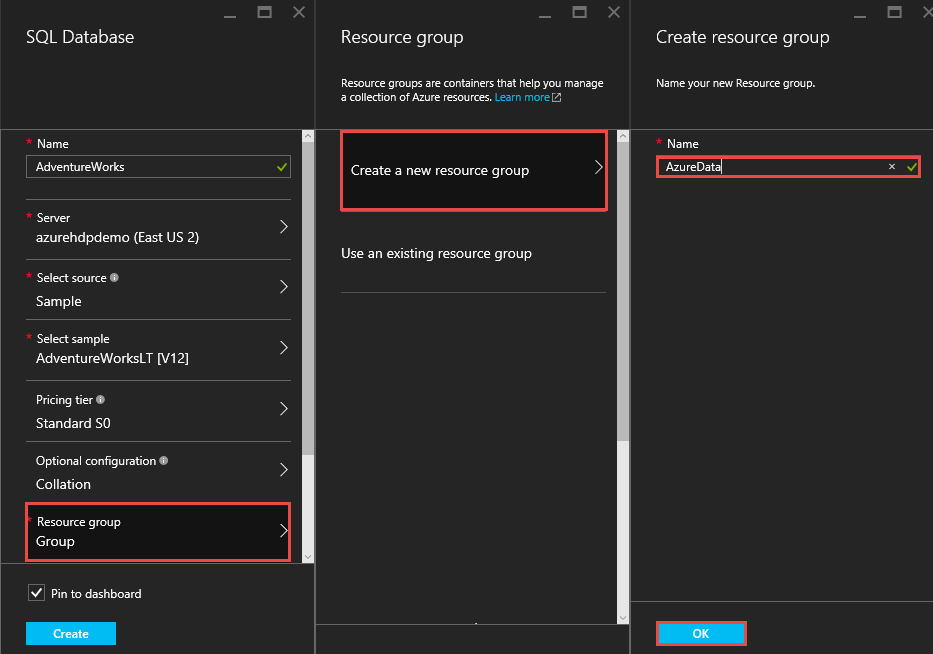

ETL in Hortonworks Sandbox on Azure
===========================================

In this **lab**, you will create a **Hortonworks Sandbox Virtual Machine** and an **Azure SQL Database** from the **Azure Marketplace**. 
You will then extract data from Azure SQL Database into the Hortonworks Sandbox using Sqoop. 
You will then load data into a Hive table in Hadoop.  

Prerequisites
---------------------------------------------------------------------------------------------------------------------------------------------------------------------------------------------------------

-   Client computer with Internet connectivity.
-   A Microsoft Azure Subscription, you can create a free trial here [Azure Trail](http://Azure.microsoft.com/en-us/pricing/free-trial/), 
	or you can use a subscription from your organization’s EA agreement.
-	Windows client computers will need an SSH client to complete the lab. 
	Alternatively you may use the web based **SSH client** built into the **Hortonworks Sandbox**.
	-	Git Bash with SSH client from <http://www.git-scm.com/downloads>
	-	[PuTTY] (http://www.putty.org/), and [AnyConnect] (http://anyconnect.net/Default.aspx) amongst others.

Objectives
----------

To create a credit risk
assessment solution, we'll follow these steps through a series of tasks:

-   Creating an Azure Environment
-	Create an SQL Azure Database
-   Create a Virtual Machine with Hortonworks Sandbox
-	Configure your Azure SQL Database for remote connectivity.
-	Transfer data using Sqoop
- 	Validate Lab Completion.

<!-- -->

###Task 1: Azure - Environment Setup

In this exercise, you will use your Microsoft or Organization account to login to the Azure preview portal to start the lab exercise.

1.  Launch an **In-Private Browser Window** and navigate to
    <https://portal.azure.com> . The following page should load.

2.	Enter the account associated with your Microsoft Azure subscription.

    

3.	If your account is associated with an organization account and a Microsoft account, 
	you may be prompted to choose which one to authenticate with for your Microsoft Azure account. 
	
	
	
###

###Task 2: Create an SQL Azure Database

In this exercise, you will create an Azure SQL Database in Azure Marketplace.

1.	Click the **+New** button from the portal, then click **Data + Storage** and choose **SQL Database** from the Marketplace.

    

2.	The Azure portal will open the **SQL Database** blade. 
	Type _AdventureWorks_ into the **Name** box. Choose **Server**, and then **Create a new server**. 
	Specify the following **New Server** configurations and click **OK**.
	
	-	**Server Name**: <Unique server name for your Azure SQL Database>
	-	**Server Admin Login**: demouser
	-	**Password**: demo@pass1
	-	**Location**: <Location nearest to you>
	-	**Create V12 Server**: Yes
	-	**Allow Azure Services to Access Server**: Checked

	
	
3.	**Note the Server Name of the SQL Database** for later reference. 

4.	Choose **Select Source**, then select **Sample**. Choose **Select Sample**, then select **AdventureWorksLT [V12]**.

	
	
	
	
5.	Choose **Resource Group**, then select **Create a New Resource Group**. Type **AzureData** for the Resource Group name and click **OK**.

	
	
6.	Verify the following SQL Database configurations and click **Create**. 
	
	-	**Name**: AdventureWorks
	-	**Server**: <Unique server name for you Azure SQL Database>
	-	**Select Source**: Sample
	-	**Select Sample**: AdventureWorksLT [V12]
	-	**Pricing Tier**: Standard S0
	-	**Resource Group**: AzureData
	-	**Subscription**: <your subscription, if you have multiple subscriptions>
	
7.	Now you will see that the SQL Database is being created, as per the status on portal dashboard.

	
	
8.	Wait until the status of Azure SQL Database is **‘Online’**. 

	
	
###

###Task 3: Create a Virtual Machine with Hortonworks Sandbox

In this exercise, you will create a virtual machine using the **‘Hortonworks Sandbox with HDP’** image available in Azure Marketplace.

1.	Click the **+New** button from the portal. Type **Hortonworks Sandbox** in the **Search** filter and press **Enter**.

	
	
2.	From the search result, click **Hortonworks Sandbox with HDP**.

	
	
3.	In the **Select a Deployment model** dropdown verify that **Classic** is selected. Read the description then click the **Create** button.

	
	
4.	Specify the following configuration options in the Create VM blade.

	-	**Name**: hortonworks-sandbox-vm
	-	**User Name**: demouser
	-	**Authentication Type**: Password
	-	**Password**: demo@pass1
	-	**Resource Group**: AzureData
	-	**Location**: Will be auto-selected to match the resource group.

	
	
5.	For the **Pricing Tier** configuration, select **A5 Standard** and click **Select**.

	

6.	For **Legal terms**, review the terms and click **Purchase**.

 	
	
7.	Verify your **Create VM Configuration**, and click **Create**.

 	

8.	Now you will see that the new virtual machine is creating, as per the status on portal dashboard.

 	
 
9.	Wait until the status of created virtual machine is **‘Running’**.  
	Note: It may take 10-15 minutes for the virtual machine to complete provisioning.

 	
	
10.	If the portal does not refresh, click **Virtual Machines (Classic)** to see the latest status of the Virtual Machine. 
	Wait until the status turns to **‘Running’**.	
	
 	
	
11.	Once the virtual machine is in status **‘Running’**, click on the **Virtual Machine Name** and go to details.
	
	
	
12.	**Note the Virtual IP Address of the Hortonworks Sandbox Virtual Machine** as you will reference it in the next step and future steps.

13.	Launch a browser and navigate to the virtual IP address of the virtual machine using port 4200 
	(http://[Virtual IP of the Hortonworks VM]:4200). This will connect you to the built-in SSH client 
	on your Hortonworks Sandbox VM. Login by entering **demouser** for the **login** and **demo@pass1** for the password.  
	
	
		
14.	Enter the following command download and extract the SQL Server JDBC driver.

	`curl -L 'https://download.microsoft.com/download/0/2/A/02AAE597-3865-456C-AE7F-613F99F850A8/sqljdbc_4.2.6420.100_enu.tar.gz' | tar xz`
	
	> NOTE:
	> *You can copy this command into your clipboard and then paste it into the terminal window open in your browser.  Simply right-click anywhere in the 
	>browser terminal window and select Paste from Browser and then paste the copied text the box provided.  This will copy the text into the terminal then 
	>click Enter on your keyboard to execute the command.*
	
15.	In the next step, copy the extracted SQL JDBC drivers to /usr/hdp/current/sqoop-client/lib. 
	*Note that use of the sudo command will require you to reenter your password*.
	
	`sudo cp sqljdbc_4.2/enu/*.jar /usr/hdp/current/sqoop-client/lib`
	
	The Shell will then resemble the next screen

	
	
16.	Execute the following commands to navigate to **/usr/hdp/current/sqoop-client/lib** to verify that the JDBC drivers are installed.

	`cd /usr/hdp/current/sqoop-client/lib`

	`ls -l sqljdbc*`

	The screen will resemble below.
	
	
17.	Restart the Hortonworks Sandbox VM so that the new driver will become available.  
	In the Portal click, **Virtual machines (Classic)** and then click the **hortonworks-sandbox-vm**.  
	When the Blade for the VM loads click **Restart**.
	
	
	
###

###Task 4: Configure your Azure SQL Database for remote connectivity

In this task, you will configure the firewall for your Azure SQL Database through the Azure Portal. 

1.	Open the **AdventureWorks Azure SQL Database** you created in Task 2.

	
	
2.	This will open the **AdventureWorks** details. Click on the **Server Name** of the AdventureWorks database.

	
	
3.	This will open the details blade of your server. Click **All Settings**, then choose **Firewall**.

	
	
4.	In the Firewall settings enter the following values then click Save:
	-	**Rule Name**: HDP
	-	**Start IP**: [Virtual IP of your Hortonworks VM]
	-	**End IP**: [Virtual IP of your Hortonworks VM]
	
	>Note: The Start IP and End IP will be the same value.

	

	> NOTE:  
	> *If for some reason the Hortonworks VM is stopped (not just restarted) from within the portal and then started again it could have a different Virtual IP address as assigned dynamically.
	>If this is the case, you will need to update this rule’s Start IP and End IP*. 

###

###Task 5: Transfer data using Sqoop

In this task you will login to the Hortonworks Sandbox VM and transfer data from your Azure SQL Database into a Hive table.

1.	Connect to the Hortonworks Sandbox VM’s SSH session by clicking the 
	Connect button within the browser that was connected before the VM restarted, 
	or by launching your browser and navigating to http://[Virtual IP of Hortonworks VM]:4200 
	(replace the placeholder value with the IP you saved earlier). 
	
2.	Execute the following command to view the available databases in your Azure SQL Database. 
	Replace the placeholder value with the name of your Azure SQL Database Server that you created and noted in Task 2.
	
	`*sqoop list-databases --connect jdbc:sqlserver://[AdventureWorks SQL Database Server Name].database.windows.net:1433 --username demouser --password demo@pass1*`
	
	Below you can see that we have the AdventureWorks database available.
	
	
3.	Next, extract data from our AdventureWorks database into a Hive table by executing the following command. 
	**Replace the placeholder value** using the SQL Database name you saved earler.
	
	`sudo -u hdfs sqoop import --connect "jdbc:sqlserver://[AdventureWorks SQL Database Server Name].database.windows.net:1433;database=AdventureWorks;user=demouser;password=demo@pass1;encrypt=true;trustServerCertificate=false;hostNameInCertificate=*.database.windows.net;loginTimeout=30;" --table SalesOrderDetail --hive-import -- --schema SalesLT`
	
	The output from the above command should return output like this.  If you scroll back through the output you will see job metrics, error and warning information, etc. 
	
	
4.	Query data from the SalesOrderDetail Hive table. Navigate to the Hue interface of your Hortonworks Sandbox VM.  
	This is located by browsing to the **Virtual IP** of the Hortonworks Sandbox VM using port 8000 http://[Virtual IP of Hortonworks VM]:8000.
	
5.	Next Click the **Beeswax** icon.  This will open the Query Editor window.

	
	
6.	In the Query Editor type the following query in the space provided and click the Execute button.

	`SELECT * FROM SalesOrderDetail`
	
	
	
	
	
###

### Task 6: Validate Lab Completion

1.	Create a screenshot that shows the essentials panel from within the Azure Portal of your Hortonworks Sandbox virtual machine instance. 

	
	
2.	Next take a screenshot of the web-based SSH connection to the Hortonworks Sandbox instance using the same IP address as the previous screenshot.
	
	

3.	A screenshot of the output of the following query from the Beeswax interface using the same IP.

	> SELECT * FROM SalesOrderDetail

	

##Summary

In this lab, you have created a Hortonworks Sandbox virtual machine from the Microsoft Azure Marketplace and an Azure SQL Database sample. 
You extracted data from the Azure SQL Database into a Hive table and queried the data from Hive

