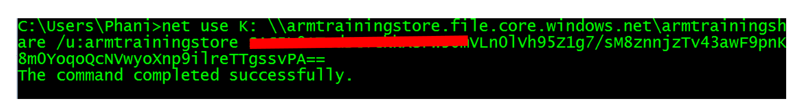

Managing Azure Storage
===========================================

In this detailed **demo**, we'll follow the process of **Creating, Managing Azure Storage Accounts**.

Prerequisites
---------------------------------------------------------------------------------------------------------------------------------------------------------------------------------------------------------

-   Client computer with Internet connectivity.
-   Microsoft Account / Live Id
-   Microsoft Azure Subscription
-   Existing Windows virtual machine

Objectives
----------
In this hands-on lab, you will learn how to:
-	Create and connect to Azure Storage account.
-	Understand storage account keys.
-	Create a container, upload file, change policy to public/container and download anonymously.
-	Copy a blob between two different storage accounts.
-	Create an Azure File Share in the portal and mount it in one of the VMs.

<!-- -->

###Task 1: Create Storage Account

In this exercise, you will create a new storage account.

1.  Launch an **In-Private Browser Window** and navigate to
    <https://portal.azure.com> . Enter the account associated with your Microsoft Azure subscription

2.	If your account is associated with an organization account and a Microsoft account you may be prompted to choose which one to authenticate with for your Microsoft Azure account. 

3.	Click **NEW**, Click **Data + Storage**, and then **Storage Account**.

	
	
4.	Change the **deployment model** to **Resource Manager** and click **Create**.

	
	
5.	Specify the following configuration and then click **Create**.

	
	
	-	Name: A unique name for your storage account 
	-	Type: Standard-LRS.
	
	>Specify the type of storage account to create. A standard storage account includes Blob, Table, Queue, and File storage. A premium storage account currently supports Azure virtual machine disks only.

	>Note: The storage account type determines how the storage account is replicated and whether it is a standard storage account or a premium storage account. The default storage account type is Standard-RAGRS, which is a standard storage account with read-access geo-redundant replication.
	
	-	Diagnostics: Indicate whether you wish to enable Diagnostics for your storage account. Diagnostics include Storage Analytics logging and metrics.
	-	Resource Group: ARMTraining
	-	Location: Select region of your choice here.
	
	>Note: As of writing of this lab, an Azure storage account has a capacity of 500TB

###

###Task 2: Storage Account Keys

1.	When you create a storage account, Azure generates two 512-bit storage access keys, these keys are used for authentication when the storage account is accessed.

2.	Storage account name along with key act like a connection string to the storage account when accessed by various third party tools and programmatically. 

3.	By providing two storage access keys, Azure enables you to regenerate the keys with no interruption to your storage service or access to that service

4.	You can access the storage account keys as follows:

	

5.	As an example, if you were to connect to Azure storage account using .Net, you would typically storage the storage account details as below:

		<configuration>
			<appSettings>
				<add key="StorageConnectionString" value="DefaultEndpointsProtocol=https;AccountName=account-name;AccountKey=account-key" />
			</appSettings>
		</configuration>

6.	As best practice you may want to explore storing the storage account key in Azure key store vault and access it from there.

###

###Task 3: Working with Azure Storage Explorer

1.	Download Microsoft’s Azure storage explorer from <http://storageexplorer.com/>

2.	Once you open the storage explorer, you will see ‘Add Azure Subscription’ option as highlighted below.

	
	
3.	Click on Connect to Microsoft Azure. Provide necessary credentials to connect to your subscriptions.

4.	Click on the ‘gear’ icon. This will display all the loaded subscriptions against your id.

	

5.	Select the current subscription of interest and click ‘Apply’.

6.	This will load up the storage accounts in that particular subscription.

	
	
7.	Create a blob container. Select the storage account created in the earlier exercise. Right click on “Blob Containers”, Select ‘Create Blob Container’. Provide a particular name (call it **newcontainer**) in the text box that comes up.
	
	
	
8.	Double click on the container created in previous step

9.	You can drag and drop file(s) here to upload the files to the container.

	-	Create a new folder on your local device desktop. Let’s call this **MyLocalStore**.

		
		
	-	Once created double-click to open it.
	
	-	Copy or create a file in this folder.
	
	-	Drag and drop the file that is created to the Azure Storage Explorer Upload location.

10. You can share this blob by specifying access control. Right-click the container. Here you can create temporary SAS based access URLs or define access level for blob/container.

	

11.	Let’s select ‘public access to container/blobs’ option.

	

12.	Right-click the blob and select ‘Copy URL to Clipboard’. 

	
	
13.	Open a new incognito browser window and paste the URL. You should be able to see the html file. You can change the access level to ‘No public access’ and refresh the browser instance. You will get resource not found message.

###

###Task 4: BLOB copy between storage accounts

1.	Back in the portal, let us create a second storage account. Give the name of the storage account “armtrainingstore2<your-name>”, suffix with your name to keep it unique.

	

2.	Open the Microsoft Azure Storage Explorer, browse to the file we uploaded earlier. Right-click and select copy. Please note that in your case the name/type of file could be different.

	
	
3.	Browse to blobcontainer2, and select ‘paste’.

	

4.	Click on Refresh to view the file that is copied to this container.

	

	>Note: Blob copy between storage accounts is pretty frequently required, it’s now relatively much easier to do this from storage explorer as compared to the number of steps required to achieve the same using PowerShell script. The number of steps are exactly the same even if the storage accounts were to belong to totally different subscriptions
	
###
	
###Task 5: Create an Azure File Share in the portal and mount it in one of the VMs created earlier

1.	Navigate through the Azure storage account as shown below:

	
	
2.	Add the following details for ‘File Share’

	
	
3.	Click on ‘Create’ button.
	
4.	Create a directory.

	

5.	Once the directory is created, you can click on ‘connect’ and copy network file share path and try to access it. You will be prompted with user-name and password. Use the storage account name and access-key as credentials.

	

6.	You can as well execute the complete ‘net use’ command and mount the file share.

	

###

##Summary

In this demo you learned how to create Azure Storage Account, Keys, Containers and Blobs its policies. Copy between storage accounts and finally setup Azure File Share using the portal.
