# Getting started with Azure App Service Web Apps and ASP.NET

This lab shows how to create an ASP.NET web application and deploy it to an Azure App Service Web App by using Visual Studio 2015 Preview. It assumes that you have no prior experience using Azure or ASP.NET. On completing the lab, you will have a simple web application up and running in the cloud.

This lab includes the following sections:

1. [Create an ASP.NET web application in Visual Studio](#create-an-aspnet-web-application)
1. [Create a SQL Database online](#create-a-sql-database-online)
1. [Deploy the application to Azure](#deploy-the-application-to-azure)
1. [Make a change and redeploy](#make-a-change-and-redeploy)
1. [Monitor and manage the site in the portal](#monitor-and-manage-the-site-in-the-management-portal)
1. [Appendix - Cleanup](#cleanup)

## Create an ASP.NET web application

In this task you will create the web application that is going to be used throughout this lab.

1. Open Visual Studio. From the **File** menu, hover over the **New** option and click **Project**.

	

    _New Project in File menu_

2. In the **New Project** dialog box, expand **C#** and select **Web** under **Installed Templates**, and then select **ASP.NET Web Application**.

3. Name the application **ContactManager** and click **OK**.

	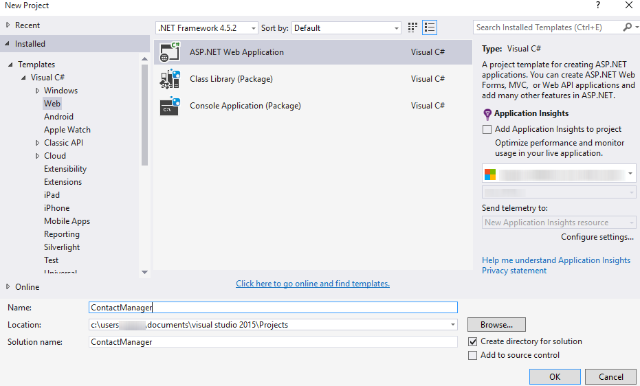

    _New Project dialog box_

	>**Note:** Make sure you enter "ContactManager". Code blocks that you will be copying later assume that the project name is ContactManager.

4. In the **New ASP.NET Project** dialog box, select the **MVC** template. Verify **Authentication** is set to **Individual User Accounts**, **Host in the cloud** is checked and **Web App** is selected. Then, click **OK**.

	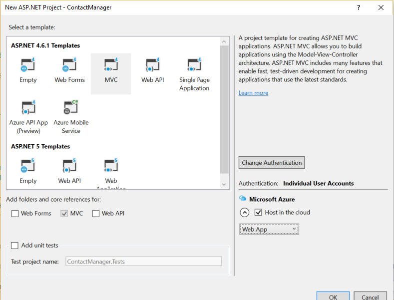

    _New ASP.NET Project dialog box_

5. Once the application is selected you will get a pop-up to enter details for **Creating an Web App**. Once you enter the details like: WebApp Name, Subsciption, Resource Group(if you have created earlier, if not create a Resource Group in Azure Portal and the list will be populated. Select the resource group)

	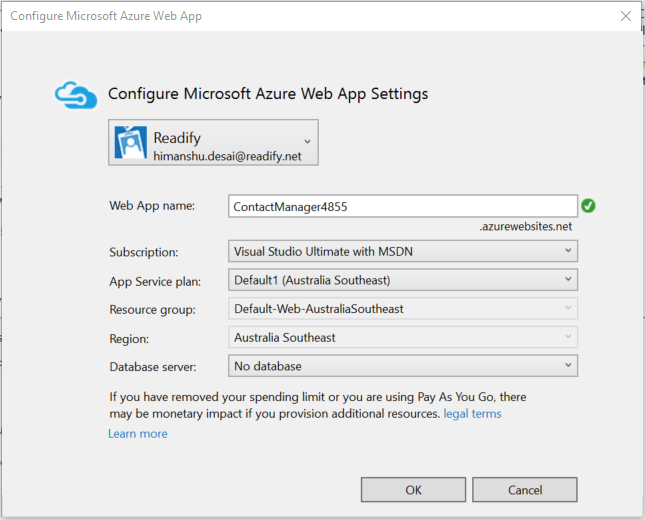

    _Details for Creating App Service_

6. As the application was created in Azure App Services, you can verify to your azure portal and check under the App Services Section you will have Contact Manager application hosted or navigate to the URL it will be **LIVE**

	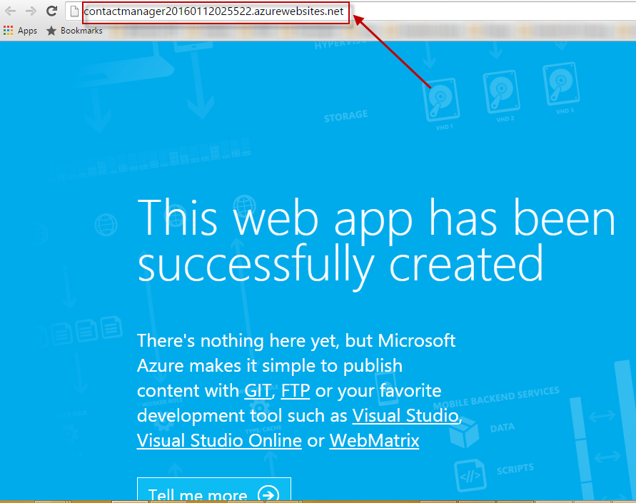

    _Created App Services - Web App_
	
7. Once the App Service is created we are ready to publish the ASP.NET Application code, click on **Publish contactmanager to this web app now**	

	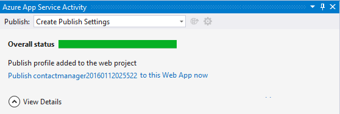

    _Configure Azure Web App - App Serive Plan_
	
	In a few seconds, Visual Studio creates the web project in the folder you specified, and it creates the Web App in the Azure region you specified.

	The **Solution Explorer** window shows the files and folders in the new project.

	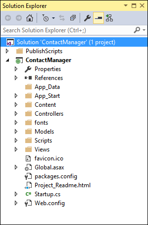

	_Solution Explorer_

## Create a SQL Database online

1. In your browser, go to [http://portal.azure.com](http://portal.azure.com), and sign in with your Azure credentials.

	On the left, click on **NEW** and **Data + Storage** and followed by **SQL Database** in the Data Storage section which is a database as a service.

2. Fill the details in **SQL Database** section.

	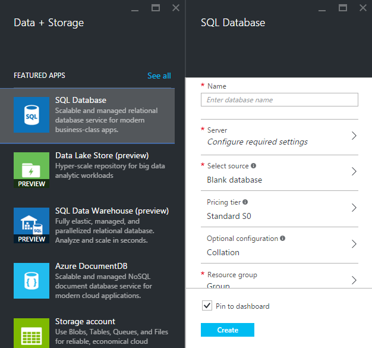

    _Database details_
	
3. Create a new **Server**(if you dont have an existing server) along with the Server Credentials, and select the **Source** as **Blank**, **Pricing Tier**, **Optional Configuration**, and select the existing **Resource Group** where we previously created App Service and Click **Create**

	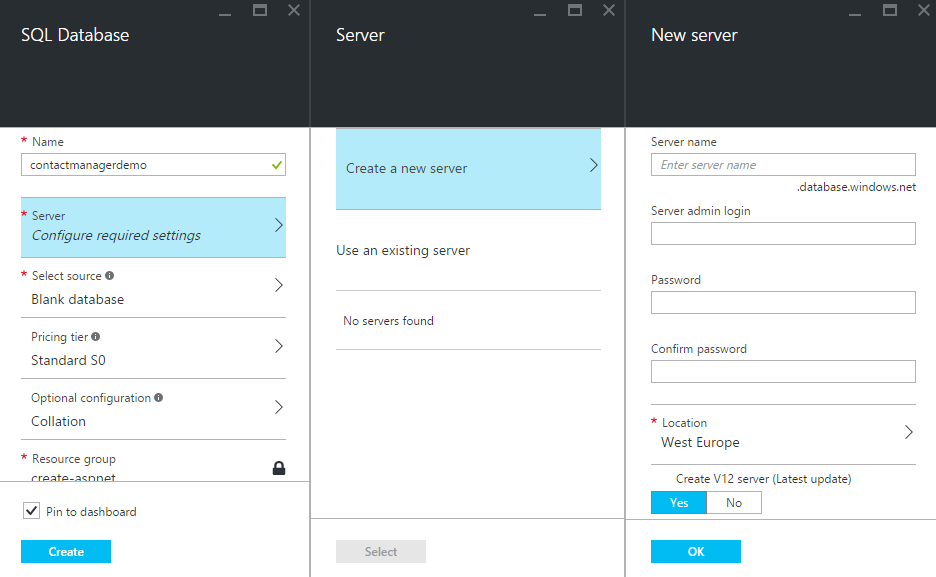

    _Create Database details_

4. Once the SQL Database is created. Click on the SQL Databases at left pane. and select the database which we created just now.

	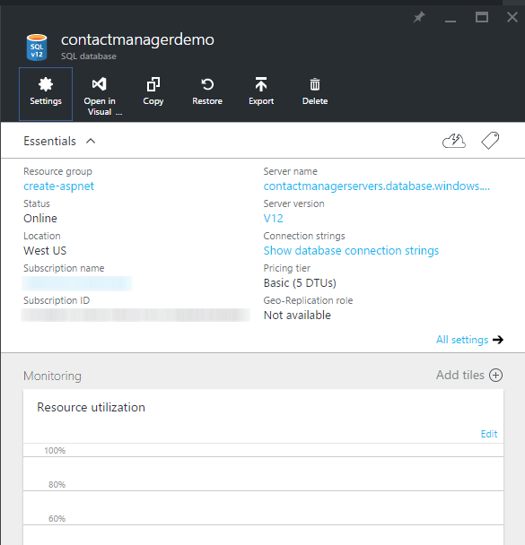

    _Created Database details_
	
5. Copy the **Connection String** from the Azure portal which will be used when we deploy the App Server as we have to point the Connection String to this database.

	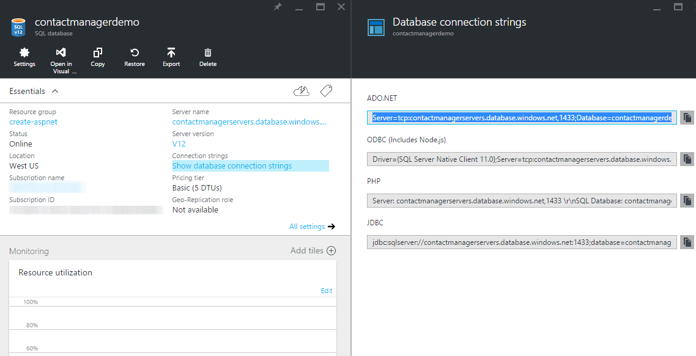

    _Created Database details_
	
## Deploy the application to Azure

1. In the **Azure App Service Activity** window, click **Publish ContactManager to this Web App now**.

	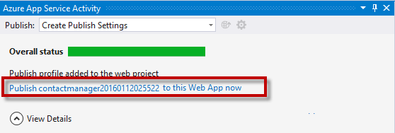

    _Azure App Service Activity Window_

	In a few seconds the **Publish Web** wizard appears.

	The settings that Visual Studio needs to deploy your project to Azure have been saved in a *publish profile*. The wizard enables you to review and change those settings.

2. In the **Connection** tab of the **Publish Web** wizard, click **Validate Connection** to make sure that Visual Studio can connect to Azure in order to deploy the web project.

	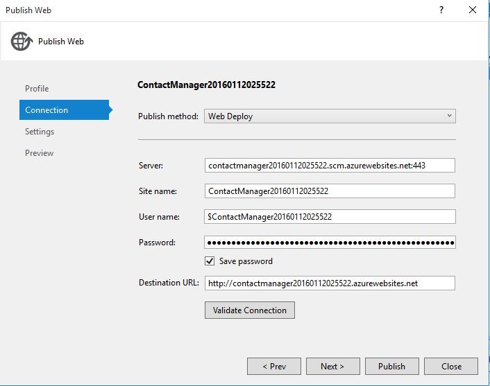

    _Validating the connection_

	When the connection has been validated, a green check mark is shown next to the **Validate Connection** button.

3. Click **Next**.

	

	_Successfully validated connection_

4. The **Settings** tab is shown. If you expand **File Publish Options** you will see several settings that enable you to handle scenarios that don't apply to this lab:

	* **Remove additional files at destination**.

		Deletes any files at the server that aren't in your project. You might need this if you were deploying a project to a site that you had deployed a different project to earlier.

	* **Precompile during publishing**.

		Can reduce first-request warm up times for large sites.

	* **Exclude files from the App_Data folder**.

		For testing you sometimes have a SQL Server database file in App_Data which you don't want to deploy to production.

	In this case, keep the default values for **Configuration** and **File Publish Options** and click **Next**.

	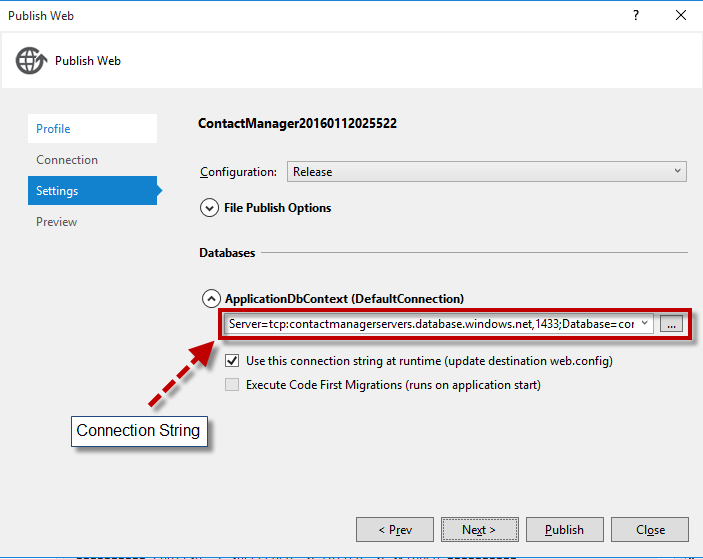

    _Settings tab_

5. In the **Preview** tab, click **Start Preview**.

	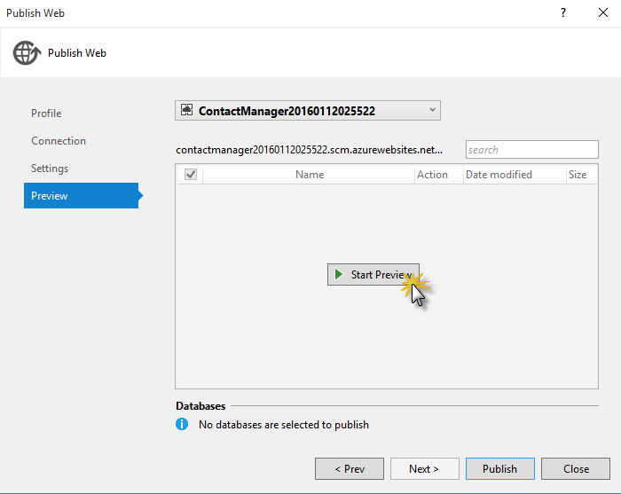

	_Start Preview button - Preview tab_

	The tab displays a list of the files that will be copied to the server. Displaying the preview isn't required to publish the application but it's a useful function to be aware of.

6. Click **Publish**.

	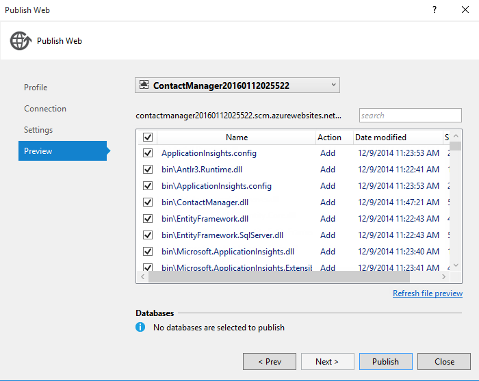

	_File Preview_

	Visual Studio begins the process of copying the files to the Azure server.

	The **Output** and **Azure App Service Activity** windows show what deployment actions were taken and report successful completion of the deployment.

	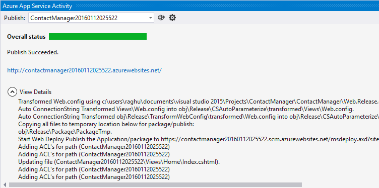

    _Azure App Service Activity reporting successful deployment_

	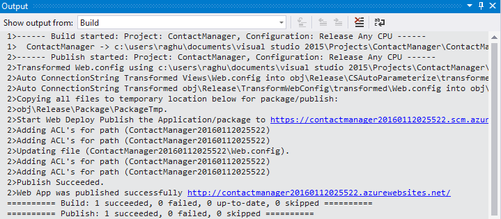

	  _Output Window reporting successful deployment_

	Upon successful deployment, the default browser automatically opens to the URL of the deployed Web App, and the application that you created is now running in the cloud. The URL in the browser address bar shows that the site is being loaded from the Internet.

	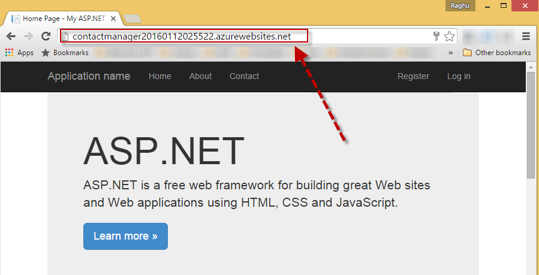

	_Web App running in Azure_

7. Close the browser.

## Make a change and redeploy

In this task, you will change the **h1** heading of the home page, run the project and redeploy on your App Service on Azure.

1. Open the *Views/Home/Index.cshtml* file in **Solution Explorer**, change the **h1** heading from "ASP.NET" to "ASP.NET and Azure", and save the file.

	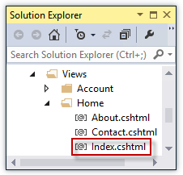

    _Index.cshtml_

	

    _Changing the page's heading_

2. Press **CTRL+F5** to see the updated heading by running the site.

	The **http://localhost** URL shows that it's running on your local computer. By default it's running in IIS Express, which is a lightweight version of IIS designed for use during web application development.

3. Close the browser.

4. In **Solution Explorer**, right-click the project, and choose **Publish**.

	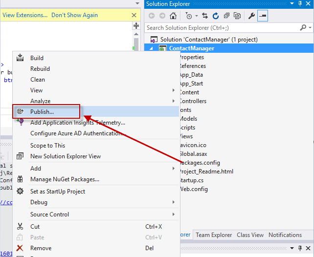

    _Preparing a new deployment_

	The Preview tab of the **Publish Web** wizard appears. If you needed to change any publish settings you could choose a different tab, but now all you want to do is redeploy with the same settings.

5. In the **Publish Web** wizard, click **Publish**.

	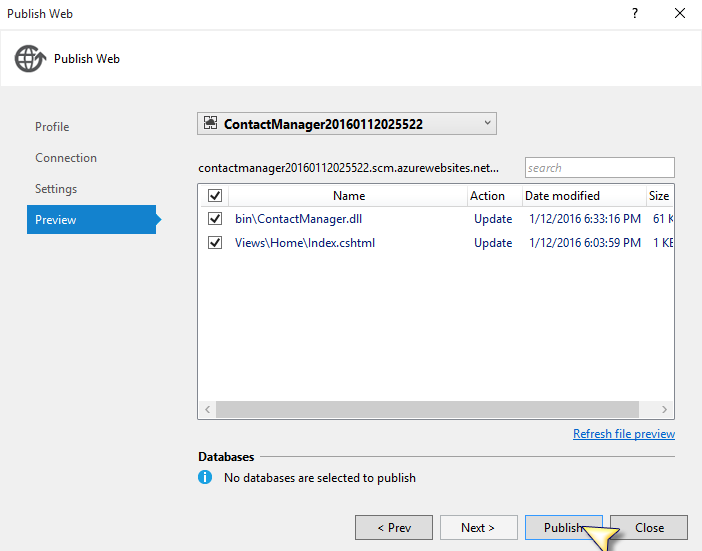

	_Publish Web Wizard_

	Visual Studio deploys the project to Azure and opens the site in the default browser.

	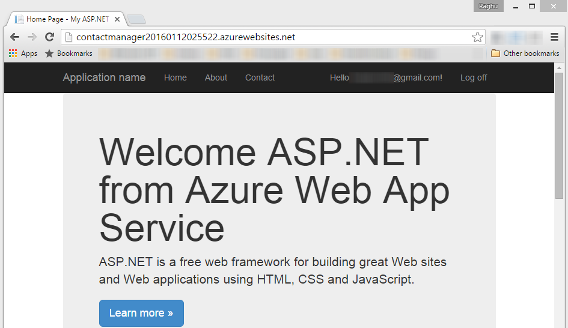

	_Changes deployed_

## Monitor and manage the site in the Azure portal

The [Azure Portal](https://portal.azure.com/) is a web interface that enables you to manage and monitor your Azure services, such as the App Service Web App you just created. In this task you will look at some of what you can do in the portal.

1. In your browser, go to [http://portal.azure.com](http://portal.azure.com), and sign in with your Azure credentials.

	On the left, click on **App Services** and the Web App Services are listed.

2. Click the name of your Web App on the blade.

3. This blade gives you an overview of your Web App.

	You can access monitoring information, change the pricing tier, configure continuous deployment and various other tasks.

	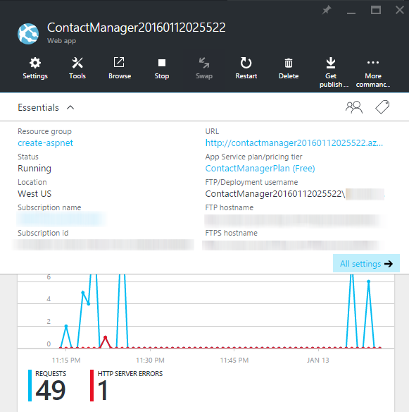

  	_Web App's overview blade_

	At this point your site hasn't had much traffic and may not show anything in the graph. If you browse to your application, refresh the page a few times, and then come back again, it will show up some traffic.

4. Click at **Settings** at the top of the blade. Then click **Application Settings**.

	The [Application Settings](http://azure.microsoft.com/en-us/documentation/articles/web-sites-configure/) blade enables you to control the .NET version used for the Web App, enable features such as [WebSockets](http://azure.microsoft.com/blog/2013/11/14/introduction-to-websockets-on-windows-azure-web-sites/) and [diagnostic logging](http://azure.microsoft.com/en-us/documentation/articles/web-sites-enable-diagnostic-log/), set [connection string values](http://azure.microsoft.com/blog/2013/07/17/windows-azure-web-sites-how-application-strings-and-connection-strings-work/), and more.

	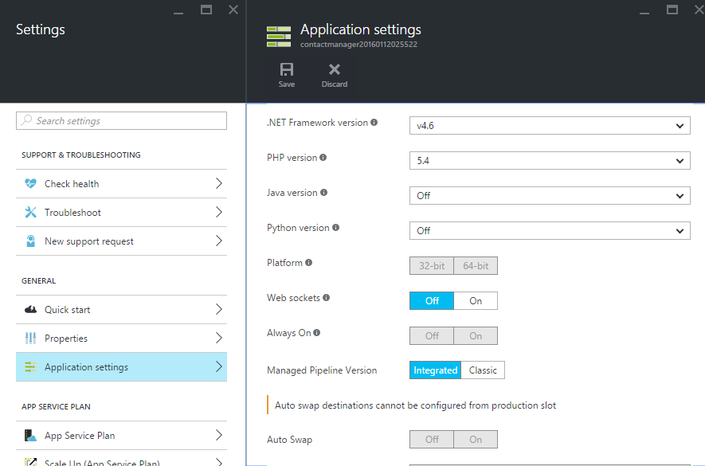

  	_WebApp's settings blade_

##Appendix - Cleanup

In this task you will learn how to delete the Web App published in the previous section.

1. In your browser, go to [http://portal.azure.com](http://portal.azure.com), and sign in with your Azure credentials.

2. Click on **Resource Groups** at left pane which will display all the resource groups created, Select the Resource group created earlier in this Lab.

4. Click **Delete** in the top bar.

	

	_Clicking Delete Resource Group_

5. In the **Delete app** confirmation dialog, click **Yes**.

	This will delete the Resource Group to which all resources are intact(i.e, App Service, App Service Plan, SQL Database, Server).
	
## Summary

In this lab you have seen how to create a simple web application and deploy it to an Azure App Service Web App. You also made a quick tour around the Azure Portal.