HOL Machine Learning – Credit Risk Analysis
===========================================

In this detailed **lab**, we'll follow the process of **developing a
predictive analytics** model in **Machine Learning Studio** and then
deploying it as an Azure Machine Learning web service. We'll start with
publicly available **credit risk data**, **develop** and **train** a
predictive model based on that data, and then **deploy the model** as a
**web service** that can be used by others for credit risk assessment.

Prerequisites
---------------------------------------------------------------------------------------------------------------------------------------------------------------------------------------------------------

-   **Client computer with Internet connectivity.**

-   **Microsoft Account / Live Id**

Objectives
----------

To create a credit risk
assessment solution, we'll follow these steps through a series of tasks:

-   Sign up for Machine Learning Workspace using a Microsoft Account

-   Create a new
    experiment with Saved Dataset

-   Train and evaluate the
    models

-   Deploy the web
    service


<!-- -->

Estimated time to complete this lab: **1-2 Hours**

### Task 1: Login

1.  Launch an **In-Private Browser Window** and navigate to
    <https://studio.azureml.net/> . The following page should load.

    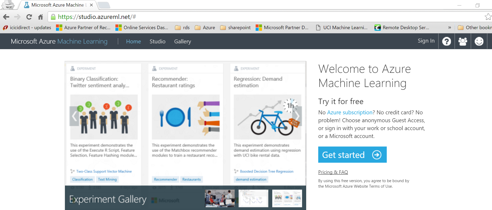

2.  Click on the **Get Started** link, which should pop up a dialog box
    as shown below

    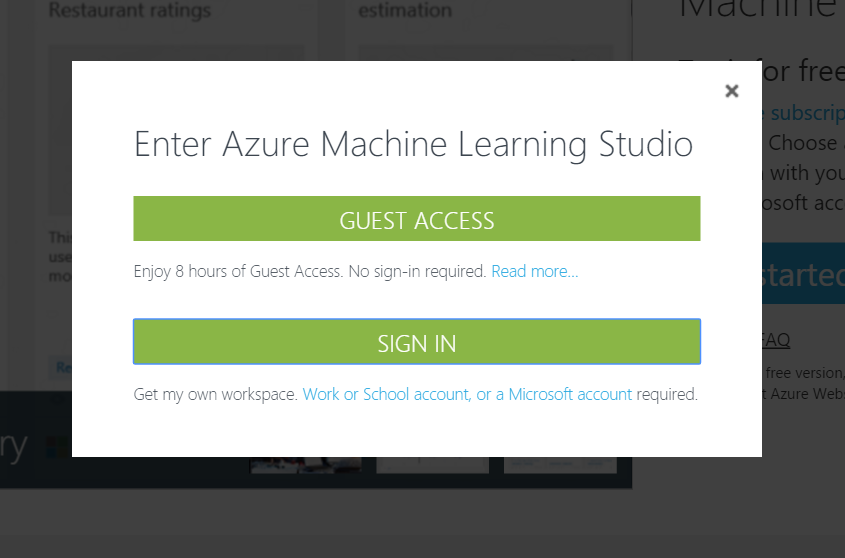

3.  We will use the Sign in through a Microsoft Account for access to a
    free Azure ML studio access.

4.  Close the Take a tour window.

    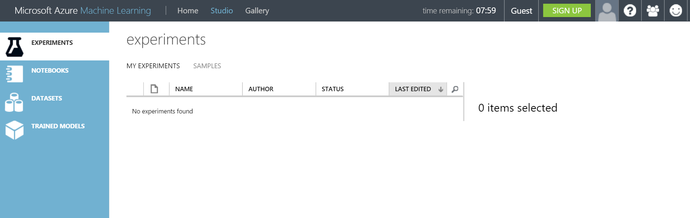

### Task 2: Create a Blank Experiment and use Existing Credit Data

1.  Click on the **+NEW** link at the bottom of the page, then Select
    **Experiment** and click on creating a **Blank Experiment**.

    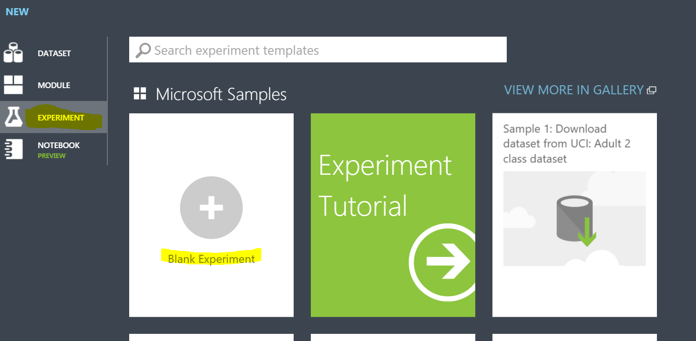

2.  Name the Experiment accordingly, the current title shows up as
    ***Experiment created on &lt;Today’s Date&gt;’***. You can edit that
    text by simply selecting and updating it. Once the name is changed,
    click on the **Save** **Save As** button at the bottom of the page

    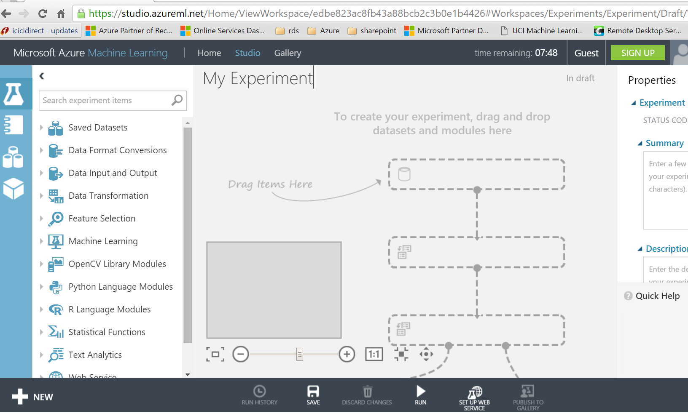

##### ***TIP:***

> *It's a good practice to fill in **Summary** and **Description** for
> the experiment in the **Properties** pane. These properties give you
> the chance to document the experiment so that anyone who looks at it
> later will understand your goals and methodology.*

1.  In the Search experiment text box, type the keyword **German,** and
    it should show **German Credit Card Data** under **Saved Datasets.**

    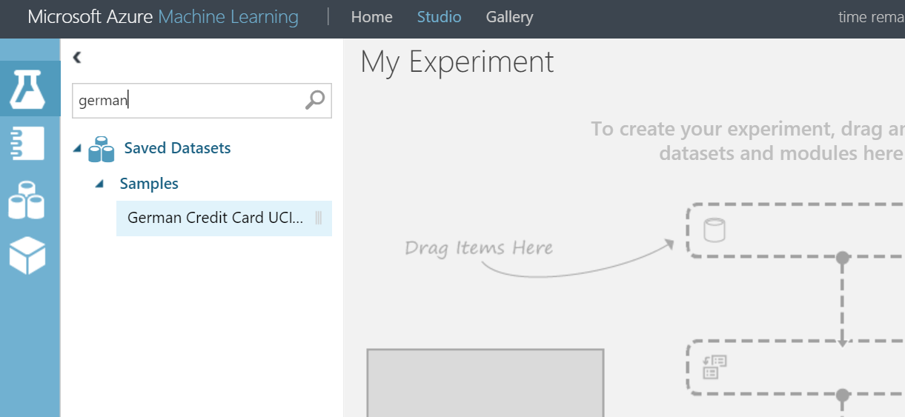

2.  Drag the German Credit Card UCI Dataset on to the **Canvas** on
    the right.

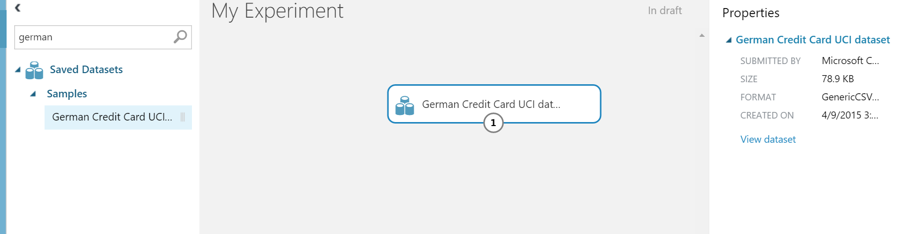


### Task 3: Preparing the Data

1.  You can view the first 100 rows of the data and some statistical
    information for the whole dataset by clicking the **output port** of
    the dataset and selecting **Visualize**. Notice that ML Studio has
    already identified the data type for each column. It has also given
    generic headings to the columns because the data file did not come
    with column headings.

    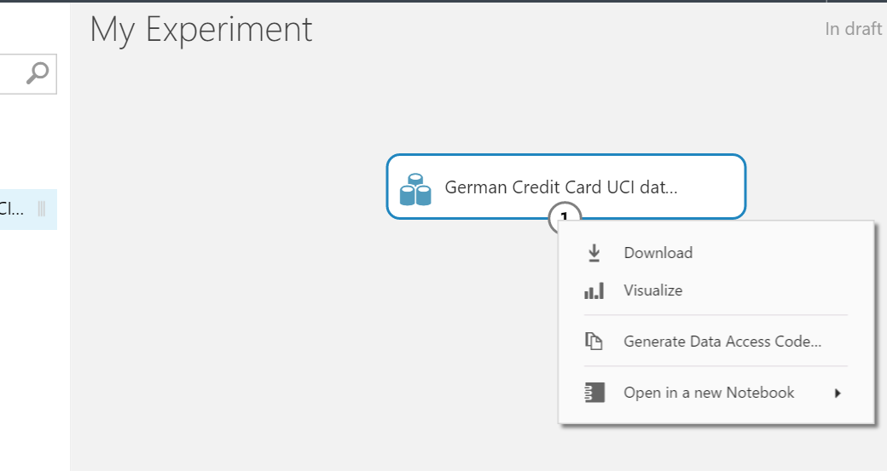

**Column headings** are not essential, but they will make it easier to
work with the data in the model. Also, when we eventually publish this
model in a web service, the headings will help identify the columns to
the user of the service. We can add column headings using
the [Metadata Editor] (https://msdn.microsoft.com/library/azure/370b6676-c11c-486f-bf73-35349f842a66/) module.
The [Metadata Editor] (https://msdn.microsoft.com/library/azure/370b6676-c11c-486f-bf73-35349f842a66/) module
is used to change the metadata associated with a dataset. In this case,
it can provide more friendly names for column headings. To do this,
we'll direct  [Metadata Editor] (https://msdn.microsoft.com/library/azure/370b6676-c11c-486f-bf73-35349f842a66/) to
act on all columns and then provide a list of names to be added to the
columns.*

1.  In the module palette **(one used before to find German Dataset)**,
    type "**metadata**" in the Search box. You'll see **Metadata
    Editor** in the module list.

2.  Click and drag the Metadata Editor module onto the canvas and drop
    it below the dataset.

3.  Connect the dataset to the Metadata Editor: click the output port of
    the dataset, drag to the input port of Metadata Editor, then release
    the mouse button. The dataset and module will remain connected even
    if you move either around on the canvas.

4.  With the Metadata Editor still selected, in the **Properties** pane
    to the right of the canvas, click Launch column selector.

5.  In the **Select columns** dialog, set the **Begin with** field to
    "**All columns**".

6.  The row beneath Begin with allows you to include or exclude specific
    columns for the Metadata Editor to modify. Since we want to modify
    all columns, delete this row by clicking the minus sign ("-") to the
    right of the row. The dialog should look like this:

> 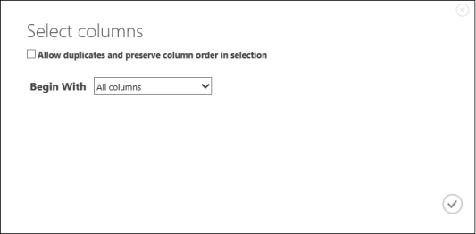

1.  Click the OK checkmark.

2.  Back in the **Properties** pane, look for the New column
    names parameter. In this field, enter a list of names for the 21
    columns in the dataset, separated by commas and in column order. You
    can obtain the columns names from the dataset documentation on the
    UCI website, or for convenience you can copy and paste the
    following:

    **status of checking account, duration in months, credit history,
    purpose, credit amount, savings account/bond, present employment
    since, installment rate in percentage of disposable income, personal
    status and sex, other debtors, present residence since, property,
    age in years, other installment plans, housing, number of existing
    credits, job, number of people providing maintenance for, telephone,
    foreign worker, credit risk**

3.  The **Properties** pane will look like this:

    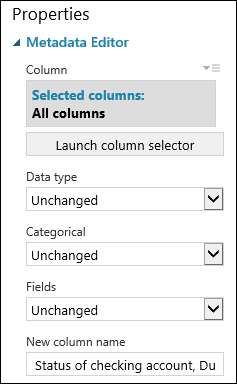

    *TIP:*

    *If you want to verify the column headings, run the experiment
    (click RUN below the experiment canvas), click the output port of
    the Metadata Editor module, and select View Results. You can view
    the output of any module in the same way to view the progress of the
    data through the experiment.*

4.  The experiment should now look something like this:

    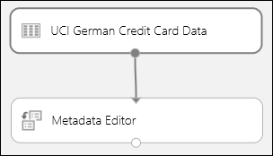

### Task 4: Create Training and Test DataSets

The next step of the experiment is to generate separate datasets that
will be used for training and testing our model. To do this, we use the
[Split](https://msdn.microsoft.com/library/azure/70530644-c97a-4ab6-85f7-88bf30a8be5f/)
module.

1.  Find the **Split** module, drag it onto the canvas, and connect it
    to the last Metadata Editor module.

2.  By default, the split ratio is 0.5 and the Randomized split
    parameter is set. This means that a random half of the data will be
    output through one port of the Split module, and half out the other.
    You can adjust these, as well as the Random seed parameter, to
    change the split between training and scoring data. For this lab,
    we'll leave them as-is.

    ***TIP**:*

    *The split ratio essentially determines how much of the data is
    output through the left output port. For instance, if you set the
    ratio to 0.7, then 70% of the data is output through the left port
    and 30% through the right port.*

3.  We can use the outputs of the Split module however we like, but
    let's choose to use the **left output as training data** and the
    **right output as scoring data**.

4.  The cost of misclassifying a high credit risk as low is 5 times
    larger than the cost of misclassifying a low credit risk as high. To
    account for this, we'll generate a new dataset that reflects this
    cost function. In the new dataset, each high example is replicated 5
    times, while each low example is not replicated.

5.  We can do this replication using **R code**. Find and drag the
    **Execute R Script** module onto the experiment canvas and connect
    the **left output port** of the Split module to the **first input**
    port ("Dataset1") of the **Execute R Script** module.

6.  In the Properties pane, delete the default text in the R Script parameter and enter this script:

   ```
    dataset1 &lt;- maml.mapInputPort(1)
    
    data.set&lt;-dataset1\[dataset1\[,21\]==1,\]
    
    pos&lt;-dataset1\[dataset1\[,21\]==2,\]
    
    for (i in 1:5) data.set&lt;-rbind(data.set,pos)
    
    maml.mapOutputPort("data.set")
   ```

We need to do this same replication operation for each output of
the [Split](https://msdn.microsoft.com/library/azure/70530644-c97a-4ab6-85f7-88bf30a8be5f/) module
so that the training and scoring data have the same cost adjustment.

1.  Right-click the [Execute R
    Script](https://msdn.microsoft.com/library/azure/30806023-392b-42e0-94d6-6b775a6e0fd5/) module
    and select **Copy**.

2.  Right-click the experiment canvas and select **Paste**.

3.  Connect the first input port of this [Execute R
    Script](https://msdn.microsoft.com/library/azure/30806023-392b-42e0-94d6-6b775a6e0fd5/) module
    to the right output port of
    the [Split](https://msdn.microsoft.com/library/azure/70530644-c97a-4ab6-85f7-88bf30a8be5f/) module.

##### ***TIP:***

> *The copy of the Execute R Script module contains the same script as
> the original module. When you copy and paste a module on the canvas,
> the copy retains all the properties of the original.*
>
> *Our experiment now looks something like this:*

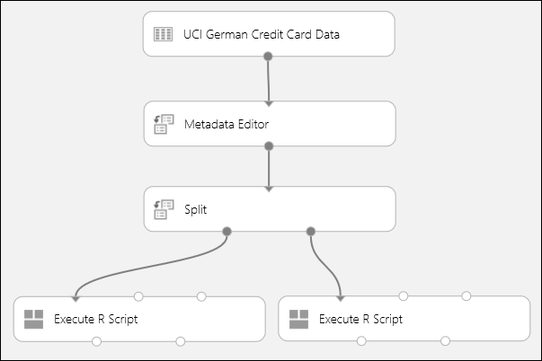

### Task 5: Train, Score and Evaluate

In this experiment we want to try different algorithms for our
predictive model. We'll create two different types of models and then
compare their scoring results to decide which algorithm we want to use
in our final experiment.

There are a number of models we could choose from. To see the models
available, expand the **Machine Learning** node in the module palette,
and then expand **Initialize Model** and the nodes beneath it. For the
purposes of this experiment, we'll select the **Two-Class Boosted
Decision** Trees module. We'll use the appropriate modules to initialize
the learning algorithms and use [Train
Model](https://msdn.microsoft.com/library/azure/5cc7053e-aa30-450d-96c0-dae4be720977/) modules
to train the model.

#### Train the model

Let's set up the boosted decision tree model:

1.  Find the [Two-Class Boosted Decision
    Tree](https://msdn.microsoft.com/library/azure/e3c522f8-53d9-4829-8ea4-5c6a6b75330c/) module
    in the module palette and drag it onto the canvas.

2.  Find the [Train
    Model](https://msdn.microsoft.com/library/azure/5cc7053e-aa30-450d-96c0-dae4be720977/) module,
    drag it onto the canvas, and then connect the output of the boosted
    decision tree module to the left input port ("Untrained model") of
    the [Train
    Model](https://msdn.microsoft.com/library/azure/5cc7053e-aa30-450d-96c0-dae4be720977/) module.

3.  Connect the left output ("Result Dataset") of the left [Execute R
    Script](https://msdn.microsoft.com/library/azure/30806023-392b-42e0-94d6-6b775a6e0fd5/) module
    to the right input port ("Dataset") of the [Train
    Model](https://msdn.microsoft.com/library/azure/5cc7053e-aa30-450d-96c0-dae4be720977/) module.

##### ***TIP:***

*We don't need two of the inputs and one of the outputs of
the *[*Execute R
Script*](https://msdn.microsoft.com/library/azure/30806023-392b-42e0-94d6-6b775a6e0fd5/)* module
for this experiment, so we'll just leave them unattached. This is not
uncommon for some modules.*

1.  Select the [Train
    Model](https://msdn.microsoft.com/library/azure/5cc7053e-aa30-450d-96c0-dae4be720977/) module.
    In the **Properties** pane, click **Launch column selector**,
    select **Include** in the first dropdown, select **column
    indices** in the second dropdown, and enter "21" in the text field
    (you can also select **column names** and enter "Credit Risk"). This
    identifies column 21, the credit risk value, as the column for the
    model to predict.

This portion of the experiment now looks something like this:

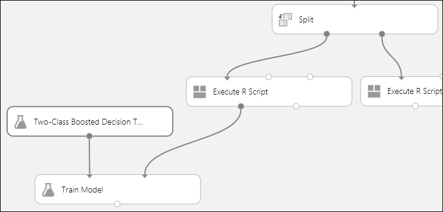

#### Score and evaluate the models

We'll use the scoring data that was separated out by
the **Split** module to score our trained models. We can then compare
the results of the two models to see which generated better results.

1.  Find the [Score
    Model](https://msdn.microsoft.com/library/azure/401b4f92-e724-4d5a-be81-d5b0ff9bdb33/) module
    and drag it onto the canvas.

2.  Connect the left input port of this module to the boosted decision
    tree model (that is, connect it to the output port of the [Train
    Model](https://msdn.microsoft.com/library/azure/5cc7053e-aa30-450d-96c0-dae4be720977/) module
    that's connected to the [Two-Class Boosted Decision
    Tree](https://msdn.microsoft.com/library/azure/e3c522f8-53d9-4829-8ea4-5c6a6b75330c/) module).

3.  Connect the right input port of the [Score
    Model](https://msdn.microsoft.com/library/azure/401b4f92-e724-4d5a-be81-d5b0ff9bdb33/) module
    to the output of the right [Execute R
    Script](https://msdn.microsoft.com/library/azure/30806023-392b-42e0-94d6-6b775a6e0fd5/) module.

To evaluate the scoring results, we'll use the [Evaluate
Model](https://msdn.microsoft.com/library/azure/927d65ac-3b50-4694-9903-20f6c1672089/) module.

1.  Find the [Evaluate
    Model](https://msdn.microsoft.com/library/azure/927d65ac-3b50-4694-9903-20f6c1672089/) module
    and drag it onto the canvas.

2.  Connect the left input port to the output port of the [Score
    Model](https://msdn.microsoft.com/library/azure/401b4f92-e724-4d5a-be81-d5b0ff9bdb33/) module
    associated with the boosted decision tree model.

The experiment should now look something like this:

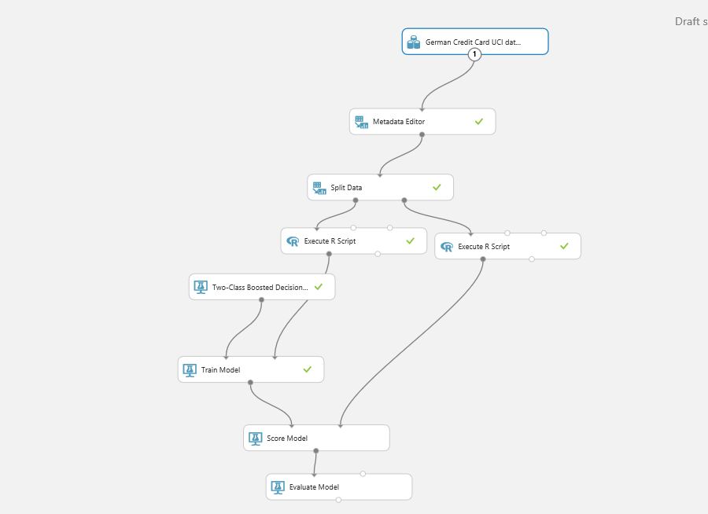

1.  Click the **RUN** button below the canvas to run the experiment. It
    may take a few minutes. You'll see a spinning indicator on each
    module to indicate that it's running, and then a green check mark
    when the module is finished.

2.  When all the modules have a check mark, the experiment has
    finished running. To check the results, click the output port of
    the [Evaluate
    Model](https://msdn.microsoft.com/library/azure/927d65ac-3b50-4694-9903-20f6c1672089/) module
    and select **Visualize**.

*The *[*Evaluate
Model*](https://msdn.microsoft.com/library/azure/927d65ac-3b50-4694-9903-20f6c1672089/)* module
produces curves and metrics that allow you to compare the results of the
two scored models or a single model. You can view the results as
Receiver Operator Characteristic (ROC) curves, Precision/Recall curves,
or Lift curves. Additional data displayed includes a confusion matrix,
cumulative values for the area under the curve (AUC), and other metrics.
You can change the threshold value by moving the slider left or right
and see how it affects the set of metrics.*

1.  Click **Scored dataset** to highlight the associated curve and to
    display the associated metrics below. In the legend for the curves,
    "Scored dataset" corresponds to the left input port of the [Evaluate
    Model](https://msdn.microsoft.com/library/azure/927d65ac-3b50-4694-9903-20f6c1672089/) module -
    in our case, this is the boosted decision tree model.

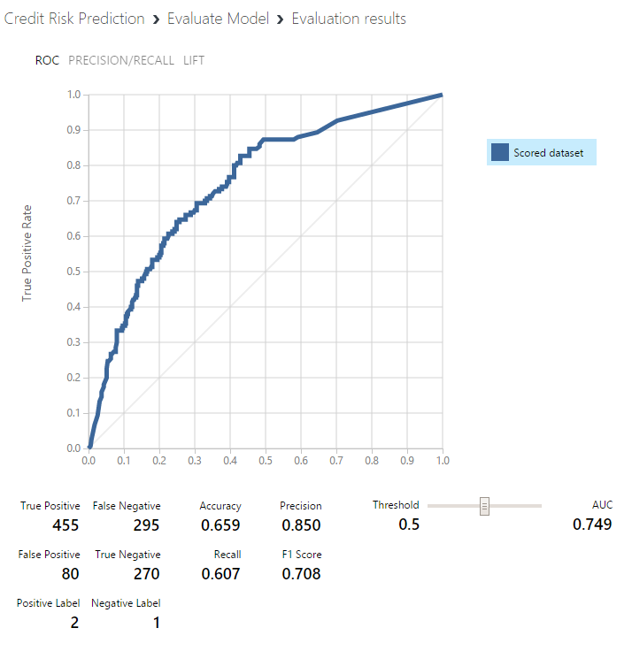
##### ***TIP:***

*Each time you run the experiment a record of that iteration is kept in
the Run History. You can view these iterations, and return to any of
them, by clicking **VIEW RUN HISTORY** below the canvas. You can also
click **Prior Run** in the **Properties** pane to return to the
iteration immediately preceding the one you have open. For more
information, see *[*Manage experiment iterations in Azure Machine
Learning
Studio*](https://azure.microsoft.com/en-in/documentation/articles/machine-learning-manage-experiment-iterations/)*.*

### Task 6: Deploy as a Web Service

To make this predictive model useful to others, we'll deploy it as a web
service on Azure.

Up to this point we've been experimenting with training our model. But
the deployed service is no longer going to do training - it will be
generating predictions based on the user's input. So we're going to do
some preparation and then deploy this experiment as a working web
service that users can access. A user will be able to send a set of
credit application data to the service, and the service will return the
prediction of credit risk.

To do this, we need to:

-   Convert the *training experiment* we've created into a *predictive
    experiment*

-   Deploy the predictive experiment as a web service

#### Convert the training experiment to a predictive experiment

Converting to a predictive experiment involves three steps:

-   *Save the model we've trained and replace our training modules with
    it*

-   *Trim the experiment to remove modules that were only needed for
    training*

-   *Define where the web service input and output nodes should be*

    1.  All three steps can be accomplished by just clicking **Setup Web
        Service** at the bottom of the experiment canvas (select
        the **Predictive Web Service** option). Click **Setup
        Web Service.**

When you click **Setup Web Service**, several things happen:

-   The model we trained is saved as a **Trained Model** module in the
    module palette to the left of the experiment canvas (you can find it
    in the palette under **Trained Models**).

Modules that were used for training are **removed**. Specifically:

-   [*Two-Class Boosted Decision
    Tree*](https://msdn.microsoft.com/library/azure/e3c522f8-53d9-4829-8ea4-5c6a6b75330c/)

-   [*Train
    Model*](https://msdn.microsoft.com/library/azure/5cc7053e-aa30-450d-96c0-dae4be720977/)

-   [*Split*](https://msdn.microsoft.com/library/azure/70530644-c97a-4ab6-85f7-88bf30a8be5f/)

-   *The second *[*Execute R
    Script*](https://msdn.microsoft.com/library/azure/30806023-392b-42e0-94d6-6b775a6e0fd5/)* module
    that was used for test data*

<!-- -->

-   *The saved trained model is added to the experiment.*

-   ***Web service input** and **Web service output** modules
    are added.*

##### **NOTE:**

The experiment has been saved in two parts: the original training
experiment, and the new predictive experiment. You can access either one
using the tabs at the top of the experiment canvas.

1.  We need to take an additional step with our experiment. Machine
    Learning Studio removed one [Execute R
    Script](https://msdn.microsoft.com/library/azure/30806023-392b-42e0-94d6-6b775a6e0fd5/) module
    when it removed
    the [Split](https://msdn.microsoft.com/library/azure/70530644-c97a-4ab6-85f7-88bf30a8be5f/) module,
    but it left the other [Execute R
    Script](https://msdn.microsoft.com/library/azure/30806023-392b-42e0-94d6-6b775a6e0fd5/) module.
    Since that module was only used for training and testing (it
    provided a weighting function on the sample data), we can now remove
    it and connect [Metadata
    Editor](https://msdn.microsoft.com/library/azure/370b6676-c11c-486f-bf73-35349f842a66/) to [Score
    Model](https://msdn.microsoft.com/library/azure/401b4f92-e724-4d5a-be81-d5b0ff9bdb33/).

Our experiment should now look like this:

> 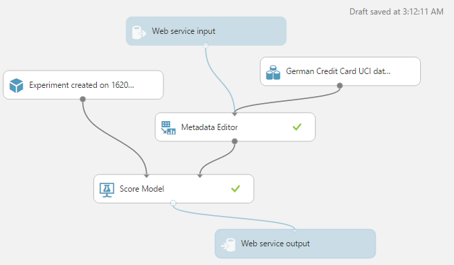

You may be wondering why we left the UCI German Credit Card Data dataset
in the predictive experiment. The service is going to use the user's
data, not the original dataset, so why leave them connected?

It's true that the service doesn't need the original credit card data.
But it does need the schema for that data, which includes information
such as how many columns there are and which columns are numeric. This
schema information is necessary in order to interpret the user's data.
We leave these components connected so that the scoring module will have
the dataset schema when the service is running. The data isn't used,
just the schema.

1.  Run the experiment one last time (click **Run**). If you want to
    verify that the model is still working, click the output of the
    [Score
    Model](https://msdn.microsoft.com/library/azure/401b4f92-e724-4d5a-be81-d5b0ff9bdb33/) module
    and select **View Results**. You'll see that the original data is
    displayed, along with the credit risk value ("Scored Labels") and
    the scoring probability value ("Scored Probabilities").

#### Deploy the web service

1.  To deploy a web service derived from our experiment, click **Deploy
    Web Service** below the canvas. Machine Learning Studio deploys the
    experiment as a web service and takes you to the service dashboard.

##### ***TIP:***

*You can update the web service after you've deployed it. For example,
if you want to change your model, just edit the training experiment,
tweak the model parameters, and click **Deploy Web Service**. When you
deploy the experiment again, it will replace the web service, now using
your updated model.*

You can configure the service by clicking the **CONFIGURATION** tab.
Here you can modify the service name (it's given the experiment name by
default) and give it a description. You can also give more friendly
labels for the input and output columns.

> 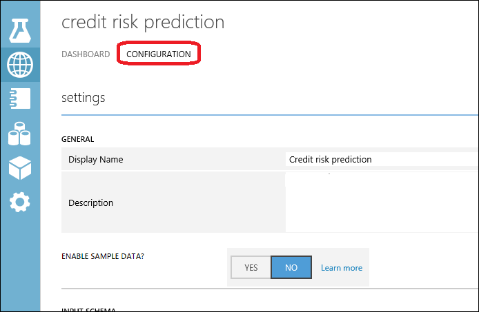

#### Test the web service

1.  On the **DASHBOARD** page, click the **Test** link under **Default
    Endpoint**. A dialog will pop up and ask you for the input data for
    the service. These are the same columns that appeared in the
    original German credit risk dataset.\
    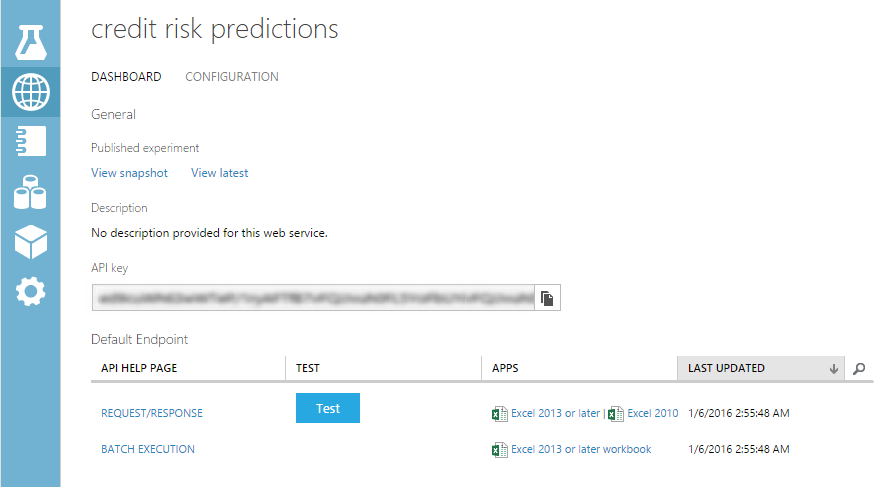

2.  Enter a set of data and then click **OK**.

The results generated by the web service are displayed at the bottom of
the dashboard. The way we have the service configured, the results you
see are generated by the scoring module.

## Summary

In this lab you learned how to provision and use a Machine Learning
    experiment from the Azure ML studio.


