Getting Started with Elastic DB Database Tools with Azure SQL
===========================================

Growing and shrinking capacity on demand is one of the key cloud
computing promises. Delivering on this promise has historically been
tedious and complex for the database tier of cloud applications. Over
the last few years, the industry has converged on well-established
design patterns commonly known as sharding. While the general sharding
pattern addresses the challenge, building and managing applications
using sharding requires significant infrastructure investments
independent of the application’s business logic.

Azure SQL Elastic DB Tools (in preview) enables the data-tier of an
application to scale in and out via industry-standard sharding
practices, while significantly streamlining the development and
management of your sharded cloud applications. Elastic database tools
delivers both developer and management functionality which are provided
through a set of .Net libraries and Azure service templates that you can
host in your own Azure subscription to manage your highly scalable
applications. Azure DB Elastic tools implements the infrastructure
aspects of sharding and thus allows you to focus on the business logic
of your application instead.

In this lab, you will be introduced to the developer experience for
Azure SQL Database Elastic tools.

This lab includes the following tasks:

-   Creating a Microsoft Azure SQL Database Server

-   Walking through the sample

-   Appendix - Cleanup

###Creating a Microsoft Azure SQL Database Server

In this task you will create a new Microsoft Azure SQL Database Server
and configure the firewall so that connections from applications running
on your computer are allowed to access the databases on your SQL
Database server.

1.  Sign in to the [Azure Portal](http://portal.azure.com).

2.  Click **New &gt; Data + Storage &gt; SQL Database**.

    > 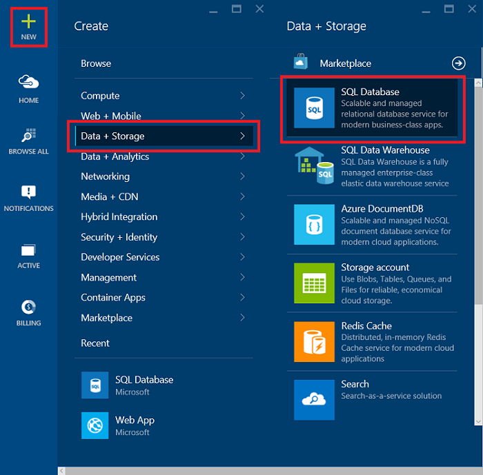
    >
    > *Navigating to the SQL Database Server tab*

3.  The **SQL Database** settings blade that appears is where you'll set
    up the **server and database** details.

    > 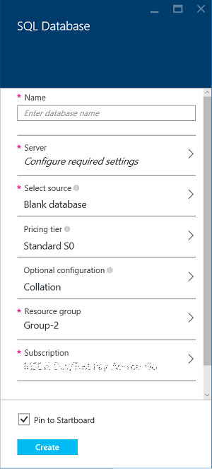

    *A SQL database in Azure lives on a database server. A server can host
    multiple databases. As you set up a database, you can also create and
    set up the server that will host it, or you can use one that was created
    earlier. We'll set up a new one.*

4.  Type a **Name** for your database. We'll come back to cover other
    database settings later.

5.  Under **Server** click **Configure required settings**, and then
    click **Create a new server**.

    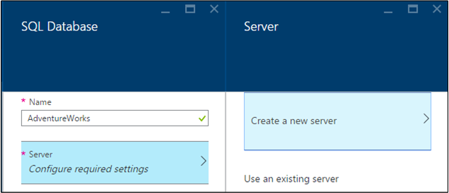

6.  In the **New server** blade, type a **Server Name** that's unique
    throughout Azure and easy to remember. You'll need this name later
    when you connect and work with your database.

7.  Type a **Server admin login** that's easy to remember. Then type a
    secure **Password** and type it again in **Confirm password**.

    > 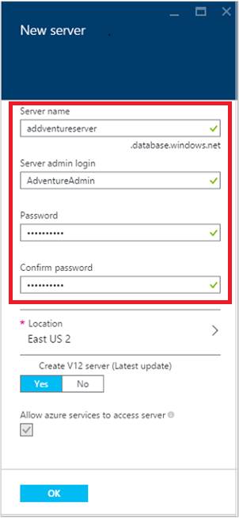
    >
    > *Leave **Create V12 Server (latest update)** set to **Yes** to use the
    > latest features. The **Location** determines the data center region
    > where your server is created*.

8.  Click **OK** to go back to **SQL Database** blade.

9.  In the **SQL Database** blade, click **Select source** and then
    click **Blank**.

    > 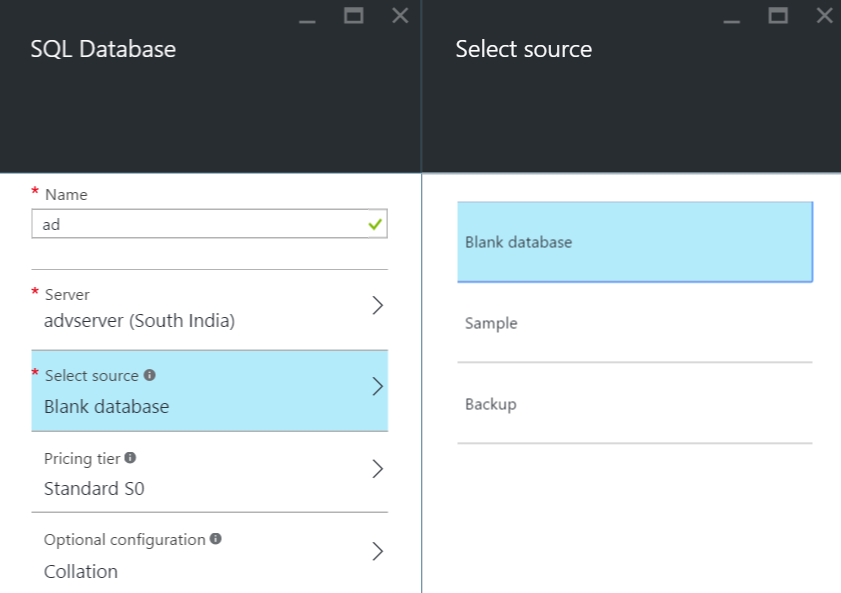

10.  Go back to the **SQL Database** blade, where **Select Source** now
    shows **Blank Database**. Click **Create** to kick off creation of
    the server and database.

    > 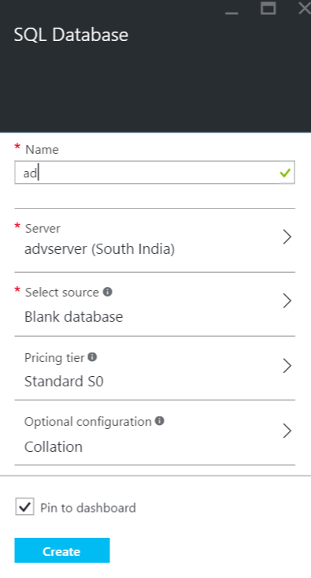
    >
    > You need to set up a firewall rule on the server that allows
    > connections from your client computer's IP address so you can work
    > with the database. This not only helps make sure you can connect, it's
    > a great way to see the area where you can get other details about your
    > SQL servers in Azure

11.  Click **Browse all**, scroll down and then click **SQL servers**,
    and then click the name of the server you created earlier from the
    list of **SQL servers**

    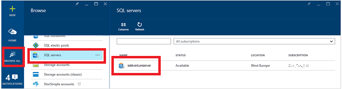

12.  In the database properties blade that appears to the right,
    click **Settings** and then click **Firewall** from the list

    > 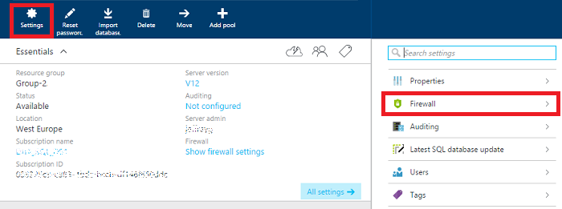
    >
    > The **Firewall settings** show your current **Client IP address**.
    >
    > 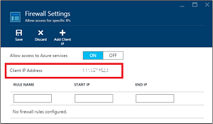

13.  Click **Add Client IP** to have Azure create a rule for that IP
    address, and then click **Save**.

    > 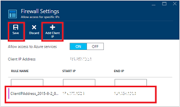

14.  Take note of the name of the **SQL Database server**
    (e.g.: *z754axd2q8*), as you will need it in the following task.

You now have a SQL Database server on Azure, a firewall rule that
enables access to the server, and an administrator login.

###Walking through the sample

The **Elastic Database with Azure SQL Database - Getting
Started** sample application illustrates the most important aspects of
the development experience for sharded applications using Azure SQL
Elastic Database Tools. It focuses on key use cases for [Shard Map
Management](http://go.microsoft.com/?linkid=9862595), [Data Dependent
Routing](http://go.microsoft.com/?linkid=9862596) and [Multi-Shard
Querying](http://go.microsoft.com/?linkid=9862597).

In this task, you will download and run this sample.

1.  Open Visual Studio and select **File -&gt; New -&gt; Project**.

    > 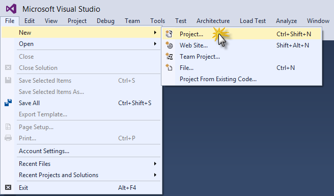
    >
    > *Creating a new project*

2.  In the *New Project* dialog box, click **Online**.

    > 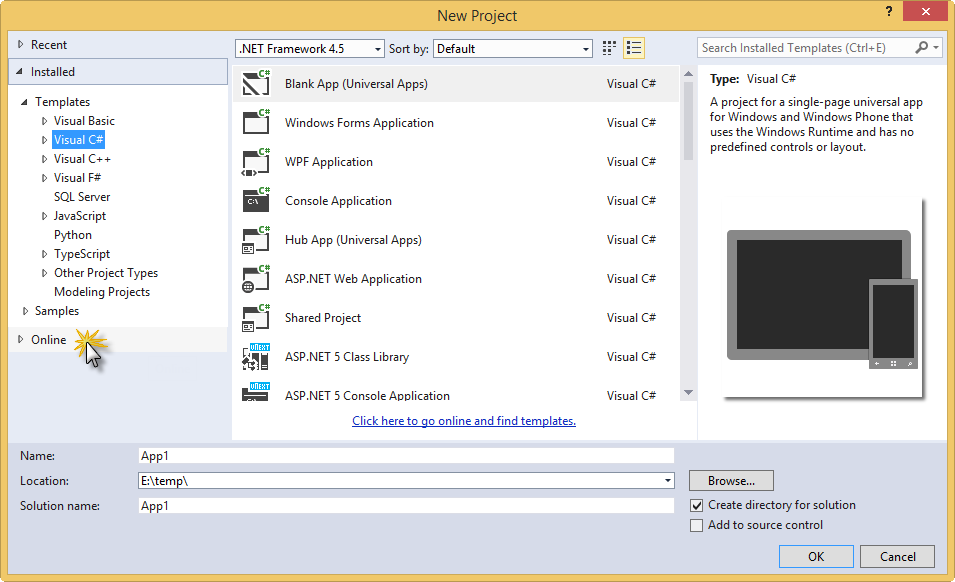
    >
    > *Clicking Online*

3.  Then click **Visual C\#** under **Samples**.

    > 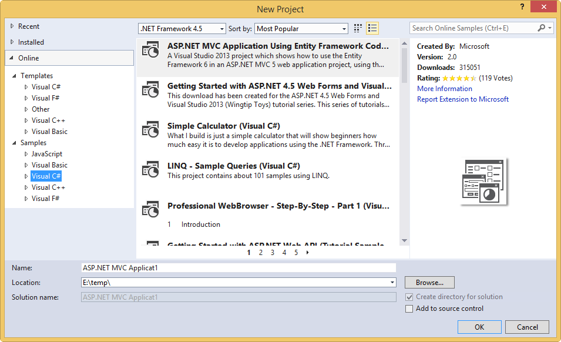
    >
    > *Navigating to online C\# samples*

4.  In the search box, type **Elastic DB** to search for the sample. The
    title **Elastic DB Tools for Azure SQL - Getting Started** appears.

5.  Select the sample, choose a name and a location for the new project
    and click **OK** to create the project.

    > 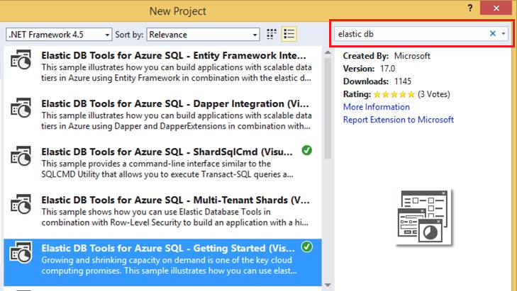
    >
    > *Creating the sample project*

6.  If the **Download and Install** dialog comes up, click **Install**.

    > 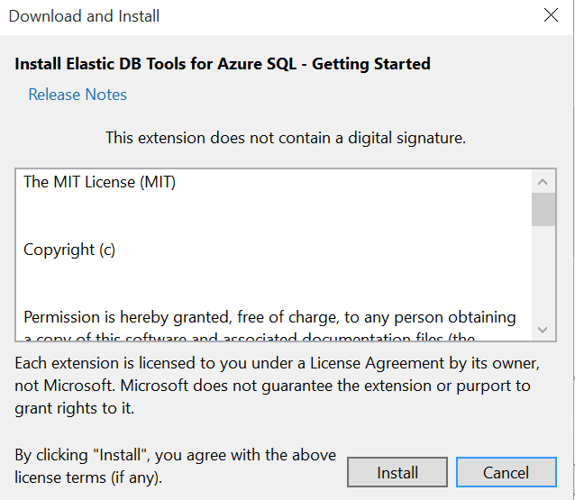
    >
    > *Clicking Install in the Download and Install dialog*

7.  Open the **App.config** file in the solution for the sample project
    and replace the *MyServerName* placeholder with your Azure SQL
    database server name and
    the *MyUserName* and *MyPassword* placeholders with your login
    information (user name and password).

    > 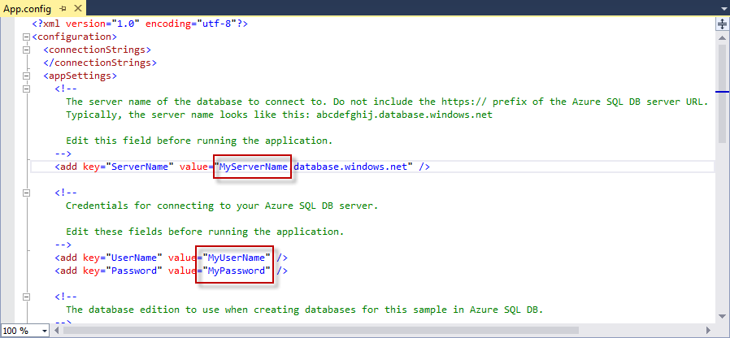
    >
    > *Configuring the sample project*

8.  Build and run the application. If asked, please allow Visual Studio
    to **restore the NuGet packages** of the solution. This will
    download the latest version of the Elastic Database Tools client
    libraries from **NuGet**.

    > 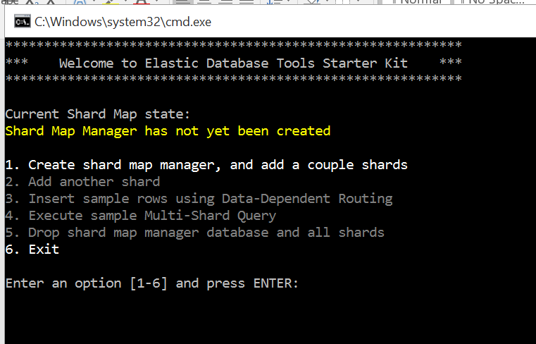
    >
    > *Running the sample*

9.  In the application, type **1** and press ***enter*** in order to
    create the shard map manager and add several shards.

    > **Note:** The code illustrates how to work with shards, ranges, and
    > mappings in file **ShardMapManagerSample.cs**. You can find more
    > information about this topic here: [Shard Map
    > Management](http://go.microsoft.com/?linkid=9862595).
    >
    > The output will look like this:
    >
    > 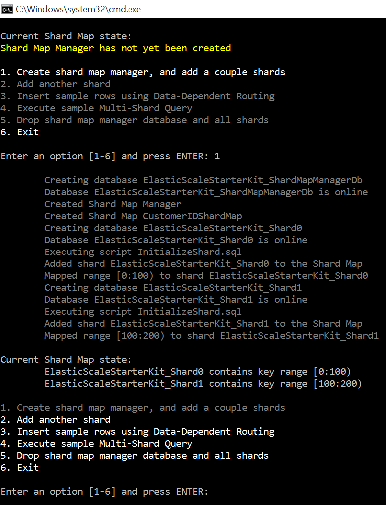
    >
    > *Creating the shard map manager and adding several shards*

10.  Switch to the [Azure Portal](http://portal.azure.com), navigate to
    the SQL Server created and click on the **SQL**
    **DATABASES** section.

    > 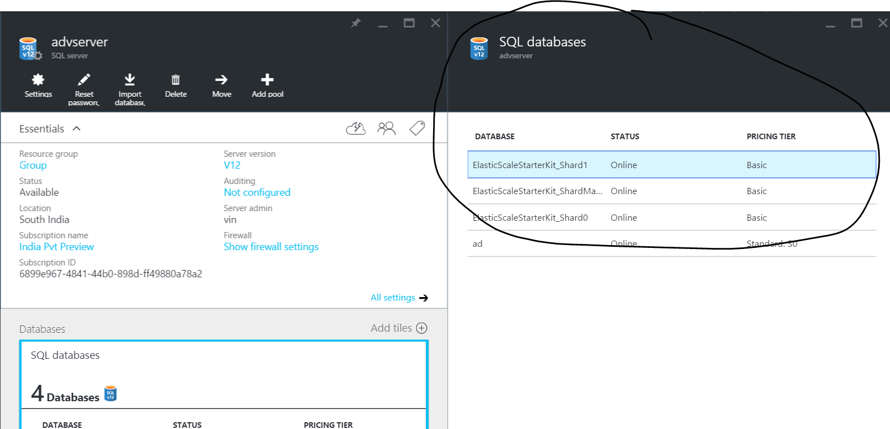
    >
    > Notice that you have three new databases: the shard manager and one
    > for each shard.

11.  Switch back to the application, type **3** and then
    press ***enter***. This will insert a sample row using
    Data-Dependent routing.

    > **Note:** Routing of transactions to the right shard is shown
    > in **DataDependentRoutingSample.cs**. For more details, see [Data
    > Dependent Routing](http://go.microsoft.com/?linkid=9862596).
    >
    > 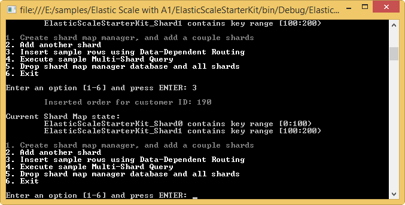
    >
    > *Inserting sample row*

12.  Repeat the last step at least three more times so that you have at
    least four rows.

13.  Now, type **4** and press ***enter*** in the application to execute
    a sample Multi-Shard Query.

    > Notice the *\$ShardName* column. It should show that the rows with
    > a *CustomerId* from 0 to 99 are located in
    > the*ElasticScaleStarterKit\_Shard0* shard and those with
    > a *CustomerId* from 100 to 199 are located in
    > the*ElasticScaleStarterKit\_Shard1* shard.
    >
    > **Note:** Querying across shards is illustrated in the
    > file **MultiShardQuerySample.cs**. For more information,
    > see [Multi-Shard Querying](http://go.microsoft.com/?linkid=9862597).
    >
    > 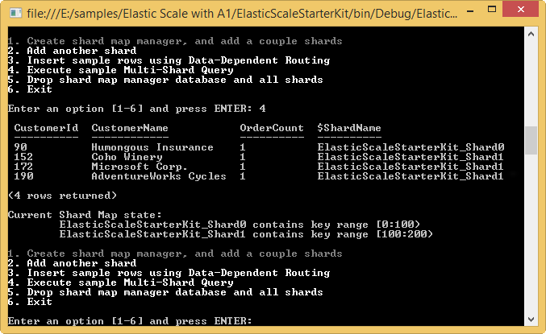
    >
    > *Executing a Multi-Shard Query*

14.  Type **2** and press ***enter*** in the application to add
    another shard. When prompted for the higher key of the new range,
    press ***enter*** to use the default value of *300*.

    > **Note:** The iterative adition of new empty shards is performed by
    > the code in file **AddNewShardsSample.cs**. For more information,
    > see [Shard Map Management](http://go.microsoft.com/?linkid=9862595).
    >
    > 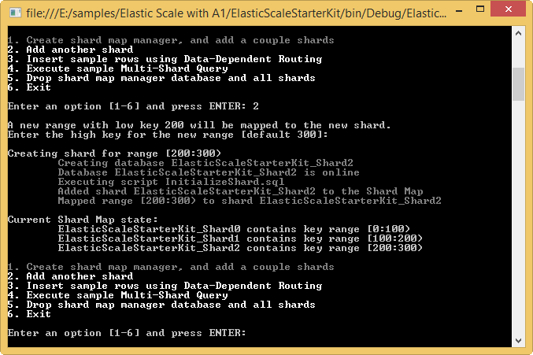
    >
    > *Adding a new shard*

15.  Switch back to the [Azure Portal](http://portal.azure.com). You
    should see a new database for the new shard
    named*ElasticScaleStarterKit\_Shard2*.

    > 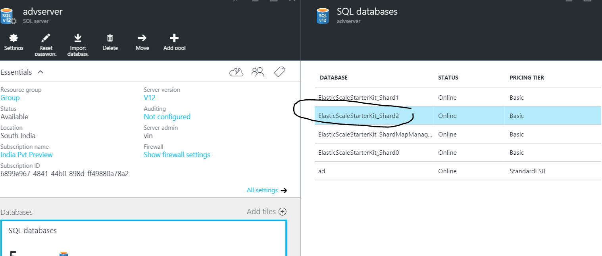
    >
    > *Viewing the new database in the portal*

16.  Switch back to the application, type **5** and press ***enter***.
    This will drop all the shards and the map manager database.

    > 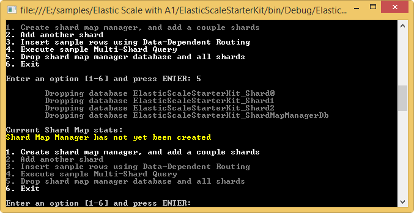
    >
    > *Removing the shards and the map manager*

17.  Stop debugging.

You have successfully built and run your first Elastic DB Tools
application on Azure SQL DB. You can find information on other Elastic
DB Tools operations in the following links:

-   **Splitting an existing shard**: The capability to split shards is
    provided through the **Split/Merge service**. You can find more
    information about this service here: [Split/Merge
    Service](http://go.microsoft.com/?linkid=9862795).

-   **Merging existing shards**: Shard merges are also performed using
    the **Split/Merge service**. For more information, see [Split/Merge
    Service](http://go.microsoft.com/?linkid=9862795).

###Appendix - Cleanup

In this task you will learn how to delete the SQL Database Server
created in the first task.

1.  Sign in to the [Azure Portal](http://portal.azure.com/).

2.  Find the server created above.

3.  Select it and then click **DELETE** from the options.

    > 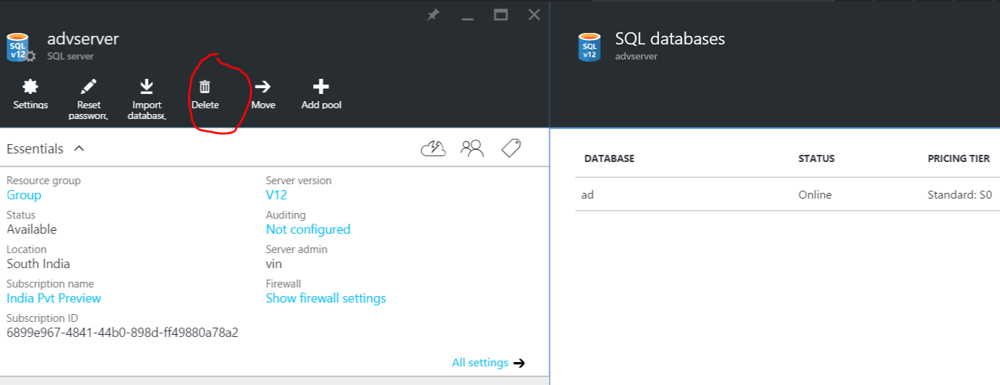

4.  In the confirmation dialog that appears, type the server name and
    the click the **Delete**.

The server will be deleted. Once it is done you should see a
notification in the bottom bar.

###Summary

By completing this lab, you have learned the basic concepts of Azure SQL
Database Elastic DB Tools: Shard Map Management, Data Dependent Routing
and Multi-Shard Querying.
