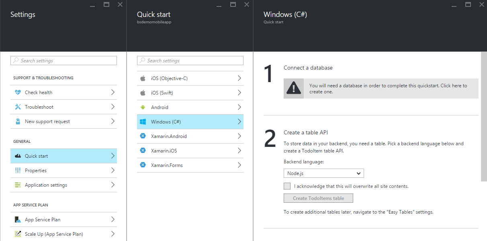
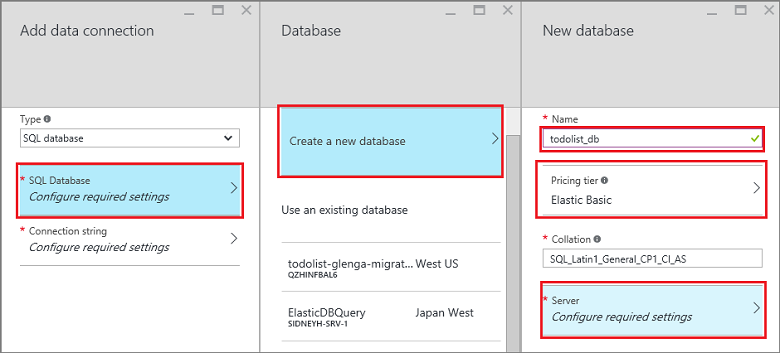
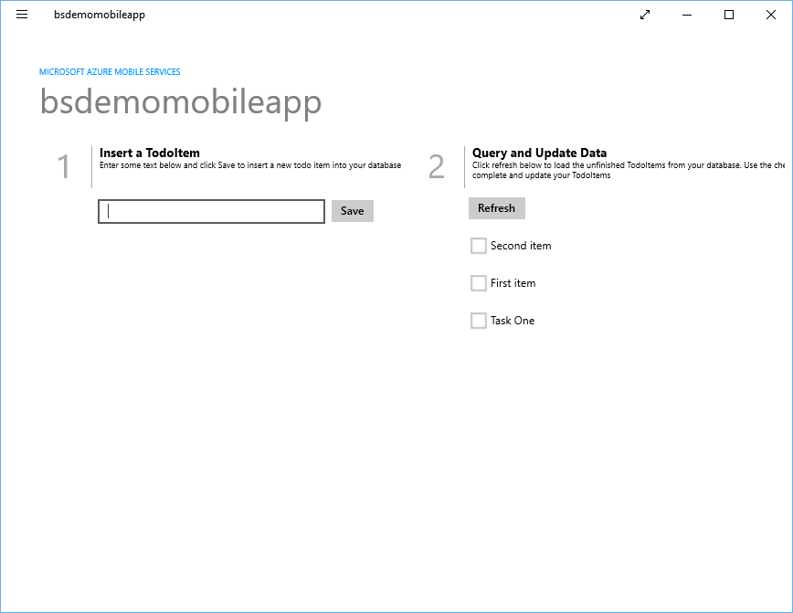
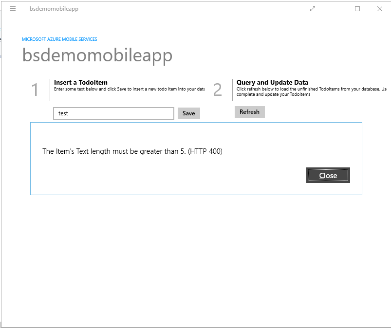

# Web Demos

> Note: These demos are verified with VS 2015 Community edition with Update 1 and Azure SDK for .Net 2.8.1

## Demo 1 - Creating a Web App

This is a quick demo showing how quickly you can create a new Web App in the portal. Feel free to change alter this first demo.

1. Browse to the [Azure Portal](https://portal.azure.com)

1. Click New / Web + Mobile / Web App.

1. Enter a unique name in the URL field and click the Create button.

1. While the site is being created, explain that Azure is provisioning a new Web App for you with supporting services, monitoring, support for continuous deployment, etc.

 > Note: This generally takes 30 - 60 seconds. During this time, you can ask them how long it would take their IT department or hosting provider to provision a new site for them. This is usually enough time for the new Web App to be created.

1. When the site comes up, scroll through the various features (Monitoring, Usage, Operations, Deployment, Networking) explaining that these are all live and have been provisioned with the Web App. You can click on the _settings_ option to bring up the _settings_ blade.
> Note: If these tiles are not visible, you can add them by clicking on 'Add tiles' button and add Deployment, Operations, Usage etc.

1. Click on the Browse button. When the default landing page loads, point out that the page illustrates the different options for publishing to the new site, including Git, FTP, Visual Studio, etc.

1.  Back in the portal, Under 'General' option select 'Application settings'. Show that .NET, PHP, Python and Java are all shown.

## Demo 2 - WebJobs

This sample demonstrates creating a WebJob and performing operations with Microsoft Azure WebJobs SDK. In this sample, the Program class starts the JobHost and creates the demo data. The Functions class contains methods that will be invoked when messages are placed on the queues and tables, based on the attributes in the method headers.

 1. Go to http://portal.azure.com and provision a new free Web App.  

 > Note: You can use the Web App you provisioned in the first demo here.

 2. In Visual Studio, go to File -> New -> Project and navigate to Visual C# -> Cloud -> QuickStarts -> Select "Azure WebJobs SDK: Tables"

 3. Select the name and location for the project and click "ok".

 4. Open the project in Visual Studio, and compile (to download all the packages required inside bin directory)

 5. Enter a storage account name and key as instructed in App.config.

 6. Right-click project, select " Publish as Azure WebJob.." and then select "run on-demand" from the dropdown.

 7. Select "Microsoft Azure App Service" and Click Next.

 8. Select the relevant subscription/ resource group and web app.

 9. Modify any details that you want here and click "Publish".

 10. Find the WebJob under the Web App node in Server Explorer, right-click and select run.
 
 11. Find the storage account in Server Explorer and show the results in queue(textinput) and table(words).

 12. Show how to run the WebJob from the Wep App's WebJob setting blade in the portal. Show the log of successful runs.

## Demo 3 - Creating an API App

This is a quick demo showing how quickly you can create a new API App using Visual Studio.

1. Create a new **ASP.NET Web Application** project using Visual Studio with the name **ProductsApp**

2. Select the **Azure API App (Preview)** project template

3. Add a Contact class to the project with the name **Product.cs**

4. Add the following code to the contact class:

		namespace ProductsApp.Models
		{
		    public class Product
		    {
		        public int Id { get; set; }
		        public string Name { get; set; }
		        public string Category { get; set; }
		        public decimal Price { get; set; }
		    }
		}

5. Delete the **ValuesController.cs** file in the **Controllers** folder.

6. Add a new Empty Controller to the Web API project using the Default Scaffolding and the name **ProductsController.cs**

7. Add the following code to the controller

		using ProductsApp.Models;
		using System;
		using System.Collections.Generic;
		using System.Linq;
		using System.Net;
		using System.Web.Http;

		namespace ProductsApp.Controllers
		{
		    public class ProductsController : ApiController
		    {
						List<Product> products = new List<Product>
		        {
		            new Product { Id = 1, Name = "Tomato Soup", Category = "Groceries", Price = 1 },
		            new Product { Id = 2, Name = "Yo-yo", Category = "Toys", Price = 3.75M },
		            new Product { Id = 3, Name = "Hammer", Category = "Hardware", Price = 16.99M }
		        };

		        public IEnumerable<Product> GetAllProducts()
		        {
		            return products;
		        }

		        public IHttpActionResult GetProduct(int id)
		        {
		            var product = products.FirstOrDefault((p) => p.Id == id);
		            if (product == null)
		            {
		                return NotFound();
		            }
		            return Ok(product);
		        }
		    }
		}

8. Deploy the application to a new API App instance in Azure

	> Ensure that the Access Level is set to **Available to Everyone**

9. Open **Internet Explorer** and navigate to **https://www.hurl.it/**

10. In the **Destination** textbox, add the URL for your API app with the relative url **/api/Products** appended to the end

	> Ensure that you use the https scheme. `https://[API App Name].azurewebsites.net/api/Products`

11. Click **Launch Request**

12. Leave the project in Visual Studio open for future demos

## Demo 4 - Basic Mobile App with Validation

Create a .NET backend using the Azure portal

You can create a new mobile application right in the [*Azure portal*](https://portal.azure.com/). You can either follow the steps below, or create a new client and server together by following the [*Create a mobile app*](https://azure.microsoft.com/en-us/documentation/articles/app-service-mobile-ios-get-started/) tutorial.

1. Log into the [*Azure Portal*](https://portal.azure.com/).

2. In the top left of the window, click the **+NEW** button > **Web + Mobile** > **Mobile App**, then provide a name for your Mobile App backend.

3. In the **Resource Group** box, select an existing resource group. If you have no resource groups, enter the same name as your app.

	At this point, the default App Service plan is selected, which is in the Free tier. The App Service plan settings determine the location, features, cost and compute resources associated with your app. You can either select another App Service plan or create a new one. For more about App Services plans and how to create a new plan, see [*Azure App Service plans in-depth overview*](https://azure.microsoft.com/en-us/documentation/articles/azure-web-sites-web-hosting-plans-in-depth-overview/)

4. Use the default App Service plan, select a different plan or [*create a new plan*](https://azure.microsoft.com/en-us/documentation/articles/azure-web-sites-web-hosting-plans-in-depth-overview/#create-an-app-service-plan), then click **Create**.

	This creates the Mobile App backend. Later you will deploy your server project to this backend. Provisioning a Mobile App backend can take several minutes; the **Settings** blade for the Mobile App backend is displayed when complete. Before you can use the Mobile App backend, you must also define a connection a data store.

	> NOTE:
	> As part of this tutorial, you create a new SQL Database instance and server. You can reuse this new database and administer it as you would any other SQL Database instance. If you already have a database in the same location as the new mobile app backend, you can instead choose **Use an existing database** and then select that database. The use of a database in a different location is not recommended because of additional bandwidth costs and higher latencies. Other data storage options are available.
 
5. In the **Settings** blade for the new Mobile App backend, click **Quick start** &gt; your client app platform &gt; **Connect a database**. 

	

6. In the **Add data connection** blade, click **SQL Database** &gt; **Create a new database**, type the database **Name**, choose a pricing tier, then click **Server**.

	

7. In the **New server** blade, type a unique server name in the **Server name** field, provide a secure **Server admin login** and **Password**, make sure that **Allow azure services to access server** is checked, then click **OK** twice. This creates the new database and server.

8. Back in the **Add data connection** blade, click **Connection string**, type the login and password values for your database, then click **OK** twice.

	Creation of the database can take a few minutes. Use the **Notifications** area to monitor the progress of the deployment. You cannot continue until the database has been deployed successfully.

9. Back in the *Quick Start* blade, under **Create a table API**, choose **C\#** as your **Backend language**

10. Click Download, extract the compressed project files to your local computer, and open the solution in Visual Studio.

### Configure the server project

1. Back in the Mobile App backend settings, click **Quick Start** > your client platform.

2. Under **Create a table API**, select **C\#** as your **Backend language**,

3. Click **Download**, extract the compressed project files to your local computer, open the solution in Visual Studio, build the project to restore the NuGet packages, then deploy the project to Azure. To learn how to deploy a .NET backend server project to Azure, see [How to: Publish the server project](https://azure.microsoft.com/en-us/documentation/articles/app-service-mobile-dotnet-backend-how-to-use-server-sdk/#publish-server-project) in the .NET backend SDK topic.

You Mobile App backend is now ready to use with your client app.

###Download and run the client project

Once you have configured your Mobile App backend, you can either create a new client app or modify an existing app to connect to Azure. In this section, you download a universal Windows app template project that is customized to connect to your Mobile App backend.

1. Back in the **Quick Start** blade for your Mobile App backend, click **Create a new app** &gt; **Download**, then extract the compressed project files to your local computer.

2. (Optional) Add the universal Windows app project to the solution with the server project. This makes it easier to debug and test both the app and the backend in the same Visual Studio solution, if you choose to do so.

3. With the Windows Store app as the startup project, press the F5 key to rebuild the project and start the Windows Store app.

4. In the app, type meaningful text, such as *Complete the tutorial*, in the **Insert a TodoItem** text box, and then click **Save**.

	

This sends a POST request to the new mobile app backend that's hosted in Azure.

5. Stop debugging, right-click the `_your app name_.WindowsPhone` project, click **Set as StartUp Project**, and then press F5 again.

Notice that data saved from the previous step is loaded from the mobile app after the Windows app starts.

###Add Server Side Validation

1. Switch to Visual Studio solution that contains the mobile service project.

2. In the Solution Explorer window expand the todo list service project and expand **Controllers**. Open the *TodoItemController.cs* file which is part of the mobile service project.

3. Replace the PostTodoItem method with the following method which will validate that the text string is not greater than 10 characters. For items that do have a text length greater than 10 characters, the method returns an HTTP Status code 400 Bad Request with a descriptive message included as content.

		public async Task<IHttpActionResult> PostTodoItem(TodoItem item) 
		{
			if (item.Text.Length < 5)
			{
				return BadRequest("The Item's Text length must be greater than 5.");
			}
			else 
			{
				TodoItem current = await InsertAsync(item);
				return CreatedAtRoute("Tables", new { id = current.Id }, current);

			}
		}

4. Right click the service project and click Build to build the mobile service project. Verify no errors occurred.

5. Right click the service project and click Publish.

###Update the Client

Now that the mobile service is setup to validate data and send error responses for an invalid text length, you need to update your app to be able to handle error responses from validation. The error will be caught as a _MobileServiceInvalidOperationException_ from the client app's call to _IMobileServiceTable<TodoItem].InsertAsync()_.

1. In the Solution Explorer window in Visual Studio, navigate to the client project and open the MainPage.xaml.cs file. Add the following using statement in that file:

		using Windows.UI.Popups;
		using Newtonsoft.Json.Linq;
		
2. In **MainPage.xaml.cs** replace the existing **InsertTodoItem** method with the following code:
		
		private async void InsertTodoItem(TodoItem todoItem)
		{
			// This code inserts a new TodoItem into the database. When the operation completes
			// and Mobile Services has assigned an Id, the item is added to the CollectionView MobileServiceInvalidOperationException invalidOpException = null;
			try
			{
				await todoTable.InsertAsync(todoItem);
				items.Add(todoItem);
			}
			catch(MobileServiceInvalidOperationException e)
			{
				invalidOpException = e;
			}
			if (invalidOpException != null)
			{
				string strJsonContent = await invalidOpException.Response.Content.ReadAsStringAsync();
				var responseContent = JObject.Parse(strJsonContent);
				MessageDialog errormsg = new MessageDialog(string.Format("{0} (HTTP {1})", (string)responseContent["message"],(int)invalidOpException.Response.StatusCode), invalidOpException.Message);
				var ignoreAsyncOpResult = errormsg.ShowAsync();
			}
		}
		
This version of the method includes error handling for the **MobileServiceInvalidOperationException** that displays the deserialized error message from the response content in a message dialog.

### Test Length Validation

1. In Solution Explorer in Visual Studio, right click the client app project and then click **Set as StartUp Project**. Then press the **F5** key to start the app hosting the service locally in IIS Express.

2. Enter the text for a new todo item with a length less than 5 characters and then click **Save**.

3. You will get a message dialog similar to the following in response to the invalid text.

## Demo 4 - Basic Mobile App with Validation

Logic Apps allow developers to design workflows that start from a trigger and then execute a series of steps. Each step invokes an App Service API app whilst securely taking care of authentication and best practices, like checkpointing and durable execution.

If you want to automate any business process (e.g. find negative tweets and post to your internal slack channel or replicate new customer records from SQL, as they arrive, into your CRM system), Logic Apps makes integrating disparate data sources, from cloud to on-premises easy.

You can create a demo by utilizing "Twitter connector" and "Dropbox connector" from marketplace by following the instructions from this [logic app tutorial](https://azure.microsoft.com/en-us/documentation/articles/app-service-logic-create-a-logic-app/).
