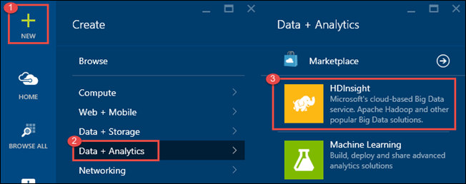
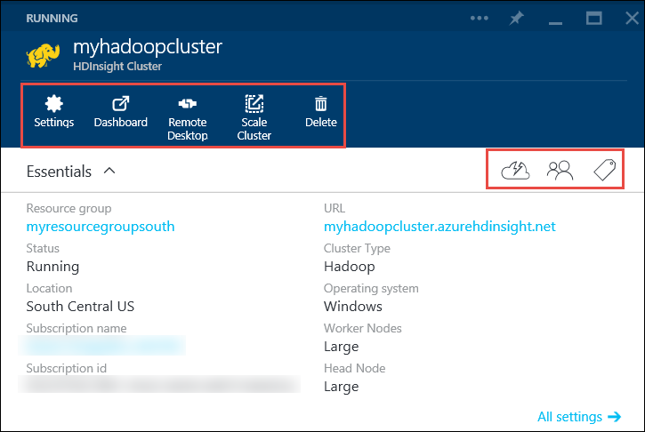

# Data Platform Demos

## Overview ##
This is a set of demos showing different data related services in the [Microsft Azure Platform](http://azure.microsoft.com/en-us/services/).

**Note:** This module does not cover the [Microsoft Azure Storage](http://azure.microsoft.com/en-us/services/storage/) Service. There is a whole separate module focusing only on Microsoft Azure [Data Storage](..\Data-Storage\Data-Storage.pptx).

<a id="goals" />
### Goals ###
In these demos, you will see how to:

1. Create a SQL Database Server and a SQL Database in the [Azure SQL Database Service](http://azure.microsoft.com/en-us/services/sql-database/).

### Setup and Configuration ###
Follow these steps to setup your environment for the demo.

1. Make sure you can sign into [Microsoft Azure Portal](http://portal.azure.com).
2. Make sure you have SSMS (SQL Server Management Studio) installed.
3. Open and run the database script to create a database called AdventureWorksProducts. This is a part of the database AdventureWorks which is one of the [Microsoft SQL Server Database Product Samples](http://msftdbprodsamples.codeplex.com). After running the script you should have the database created in the local server you selected.

## Demo 1) Creating A SQL Database Server and a SQL Database ##

In this dem you will use the new Azure Portal (Ibiza) to create a new database server.

1. Log into [http://portal.azure.com](http://portal.azure.com)
2. Click on “new +” in the bottom left corner and select SQL Database.
3. Enter Database name and select source -> Blank database.
4. Open up Pricing Tier and “Browse all pricing tiers”. Show the tiers and then select one. For instance “Basic”!
5. Click on Server and enter a name. Point out that the old (current) portal does not allow you to specify your own name for the server.
6. Enter the data you wish for server.
7. Click Create and let it create.
8. Show the database. Also click on properties and show the connection strings.

> **Speaking point:** In this way or with command-line tools like PowerShell and xplat-cli you can create and manage any number of databases in a matter of seconds. [Azure Command-line Tools](http://azure.microsoft.com/en-us/downloads/)

## Demo 2) Connect from on premise and deploy your database ##

Using the same database server from before…

1. Back in the portal with the database from last demo, click on “Open in Visual Studio” and firewall. Show that it’s work in progress here.
2. Go to the old portal and configure firewall based on current IP. Reload this in the new portal and see the firewall rule there.
3. Click Open in Visual Studio and show the database from Visual Studio.
4. Open SSMS (SQL Server Management Studio) and the connect dialog. (Note: It’s probably a good idea to run at least SQL Server Developer Edition on your local machine.)
5. Back in the portal again reopen the connection strings. This is a good place to find the exact credentials to connect to  your database!
6. In the connection string for ADO.NET copy your server name from the Server property “Server=tcp:{your server name},1433” and paste as Server name in SSMS.
7. Copy the User Id from the connection string “Username@Servername” and paste as Login in SSMS.
8. Type the password and connect.

> **Speaking point:** It is pretty much the same experience as before only now the databases are in the Cloud!

9. From SSMS connect to a local SQL Server with the demo database.
10. For instance you can use Adventureworks demo database: http://msftdbprodsamples.codeplex.com.
11. Right click on the database and choose Tasks -> "Deploy Database to Windows Azure SQL Database...". This is a very short wizard which will deploy the whole thing to Azure!

> **Speaking point:** The tool [SQL Azure Migration Wizard](http://sqlazuremw.codeplex.com) is an amazing tool to analyze databases for compatibility with Azure!

12. Using SSMS open up the database in Azure!

## Demo 3) DAC Deployment From SQL Server Management Studio ##

Use SSMS to deploy DAC pack to previously provisioned database server.

**Preparation:**

   * In SSMS right-click your database and choose -> Tasks -> Extract data-tier application.
   * Follow the wizard to export your .dacpac.

Demo:

1. In SSMS connect to your SQL Database Server in Azure.
2. Right click “Databases” -> “Deploy data-tier Application…”.
3. Follow the wizard and select your .dacpac.
4. Deploy the database.

You now have a database in Azure but no data deployed to it. In order to do that instead use a .bacpac

## Demo 4) Standing up a SQL Server in Azure using Marketplace ##

1. Use [http://portal.azure.com](http://portal.azure.com)
2. Enter Marketplace.
3. Select Data -> SQL Server -> Any SQL VM you like. For example “SQL Server 2012 SP2 on Windows Server 2012”. Click create.
4. Show Pricing tier (including all pricing tiers) and other creation options and settings.
5. Deploy it!

(Don’t forget to delete it or at least stop it later to reduce cost on your Azure account.)

> **Speaking point:** There are other fully supported options for SQL Storage in Azure, including Oracle and MySQL. These can all be viewed in the Marketplace.

## Demo 5) View Document DB in the Azure Management Portal and create data using code ##

1. Use [http://portal.azure.com](http://portal.azure.com)
2. Create a new DocumentDB and view it.
3. Show Keys, Scale and Configuration.
4. Open up the Developer Tools:
    * Document Explorer
    * Query Explorer
5. In the Visual Studio demo solution open the class DocumentDBDemoTests and run the unit tests there sequentially while explaining what happens. Some of the tests fetch data from our SQL database Adventure Works which we have used previously. You might want to pull that data from your on premise SQL Server instance rather than from the SQL Database version which will be faster.
    * CreateDatabaseAndCollection() - Creates a database and a collection. There is console output which can be commented.
    * CreateData_Sequentially() - Get 504 documents and start creating them sequentially. This will take a long time! So after a brief time stop execution and explain that this takes too long to do sequentially. Go back to the portal and view these documents.
    * CreateStoredProcedure() - Create a stored procedure in the collection for bulk insertions.
    * DeleteAllDocuments() - Delete the previously created documents again. (The proc does not support inser/replace or upsert only clean insert of items that are not pre-existing.)
    * BulkInsert() - Run bulk insertions of 50 docs at a time. Some times there is a throttle error (usually when inserting the last four doc because they come so quickly after the last 50 batch). This does not always happen though. If it does there will be a retry. Look at the console output.
    * QueryData() - Room to run any query you like. Can also be demoed in the portal Query explorer. Example SELECT * FROM c where c.Reviews != null.
    * DeleteDatabase() - Delete the data, collection and database.

## Demo 6) Azure Search walk through ##

* There are slides in the deck which are a walk through of the basic features of Azure Search.
* Also show Azure Search in the portal: [http://portal.azure.com](http://portal.azure.com)

## Demo 7) HDInsight Cluster Setup and Walkthrough ##

The Microsoft Azure portal is a central place where you can provision and manage your Azure resources. Azure Portal is one of the tools you can use to create either Linux-based or Windows-based Hadoop cluster in HDInsight.

In this detailed **demo**, we'll follow the process of **create either Linux-based or Windows-based Hadoop cluster in HDInsight**.

Prerequisites
---------------------------------------------------------------------------------------------------------------------------------------------------------------------------------------------------------

-   **Client computer with Internet connectivity.**
-   **Microsoft Account / Live Id**
-   **Microsoft Azure Subscription**

Objectives
----------

To create a credit risk
assessment solution, we'll follow these steps through a series of tasks:

-   Creating HDInsight Cluster using Azure portal

-   Use Hive with HDInsight to analyze logs from websites
<!-- -->

###Task 1: Creating HDInsight Cluster

1.  Launch an **In-Private Browser Window** and navigate to
    <https://portal.azure.com> . The following page should load.

2.  Click **NEW**, Click **Data Analytics**, and then click **HDInsight**.

    

3.  Type or select the following values:

	-  **Cluster Name**: Enter a name for the cluster. A green check 
		will appear beside the cluster name if the name is available.
    -	**Cluster Type**: Select Hadoop. Other options inclue HBase, Storm, and Spark.
	-	**Cluster Operating System**: Select Windows. To create a Linux-base cluster, 
		select Linux. For our demo, let’s use Windows based Cluster 
	-	**Version**: See [HDInsight versions](https://azure.microsoft.com/en-in/documentation/articles/hdinsight-component-versioning/). 
	-	**Subscription**: Select the Azure subscription that will be used for creating this cluster.
	-	**Resource Group**: Select an existing or create a new resource group
    -	**Credentials**: Configure the username and the password for the Hadoop user (HTTP user). 
		If you enable remote desktop for the cluster, you will need to configure the remote desktop 
		user username and password, and an account expiration date. Click Select at the bottom to save the changes.
		
	

	-  **Data Source**: Create a new or select an existing Azure Storage account to be used 
		as the default file system for the cluster.

    
	
	-  **Selection Method**: Set this to **from all subscriptions** to enable browsing 
		of storage accounts from all your subscriptions. Set this to **Access Key** if you 
		want to enter the **Storage Name** and **Access Key** of an existing storage account.
	-	**Select storage account/Create New**: Click Select storage account to browse and 
		select an existing storage account you want to associate with the cluster. Or, 
		click Create New to create a new storage account. 
	-	**Choose Default Container**: Use this to enter the name of the default container to use for the cluster. 
		While you can enter any name here, we recommend using the same name as the cluster so that you can easily 
		recognize that the container is used for this specific cluster.
	-	**Location**: The geographic region that the storage account is in, or will be created in. 
		This location will determine the cluster location. The cluster and its default storage account must 
		co-locate in the same Azure data center.
	-	**Node Pricing Tiers**: Set the number of worker nodes that you need for the cluster. 
		The estimated cost of the cluster will be shown within the blade.

	
	
	-	**Optional Configuration** to select the cluster version, as well as configure other optional 
		settings such as joining a **Virtual Network**, setting up an **External Metastore** to hold data for Hive and Oozie, 
		use Script Actions to customize a cluster to install custom components, or use additional storage accounts with the cluster.
	-	**HDInsight Version**: Select the version you want to use for the cluster. For more information, see HDInsight cluster versions.
	-	**Virtual Network**: Select an Azure virtual network and the subnet if you want to place the cluster into a virtual network.

	

	>  NOTE:
	>	*Windows based HDInsight cluster can only be placed into a classical virtual network.*

	-	**External Metastores**: Specify an Azure SQL database to store Hive and Oozie metadata associated with the cluster.

	>	NOTE:
	>	 *Metastore configuration is not available for HBase cluster types.*
	
	

	For **Use an existing SQL DB for Hive** metadata, click **Yes**, select a SQL database, and then provide the username/password for the database. 
	Repeat these steps if you want to **Use an existing SQL DB for Oozie** metadata. Click **Select** till you are back on the **Optional Configuration** blade.

	>	NOTE:

	>	The Azure SQL database used for the metastore must allow connectivity to other Azure services, 
	>	including Azure HDInsight. On the Azure SQL database dashboard, on the right side, click the server name. 
	>	This is the server on which the SQL database instance is running. Once you are on the server view,
	>	click **Configure**, and then for **Azure Services**, click **Yes**, and then click **Save**.	

	-	**Script Actions** if you want to use a custom script to customize a cluster, as the cluster is being created. 
		For more information about script actions, see [Customize HDInsight clusters using Script Action] (https://azure.microsoft.com/en-in/documentation/articles/hdinsight-hadoop-customize-cluster/). 
		On the Script Actions blade provide the details as shown in the screen capture.
	
	
	
	-	**Azure Storage Keys**: Specify additional storage accounts to associate with the cluster. 
		In the Azure Storage Keys blade, click Add a storage key, and then select an existing storage account or create a new account.
	
	
	
4.  Click **Create**. Selecting **Pin to Startboard** will add a tile for cluster to the Startboard of your Portal. The icon will indicate that the cluster is being created, and will change to display the HDInsight icon once creation has completed.

	It will take some time for the cluster to be created, usually around 15 minutes. Use the tile on the Startboard, or the **Notifications** entry on the left of the page to check on the provisioning process.

5.  Once the creation completes, click the tile for the cluster from the Startboard to launch the cluster blade. The cluster blade provides essential information about the cluster such as the name, the resource group it belongs to, the location, the operating system, URL for the cluster dashboard, etc.

	

Use the following to understand the icons at the top of this blade, and in the **Essentials** section:
-	**Settings** and **All Settings**: Displays the **Settings** blade for the cluster, 
	which allows you to access detailed configuration information for the cluster.
-	**Dashboard, Cluster Dashboard, and URL**: These are all ways to access the cluster dashboard, which is a Web portal to run jobs on the cluster.	
-	**Remote Desktop**: Enables you to enable/disable remote desktop on the cluster nodes.

### 

### Task 	2: Use Hive with HDInsight to analyze logs from websites

Website log analysis can be used to segment your audience based on similar activities, categorize site visitors by demographics, and to find out the content they view, the websites they come from, and so on.

In this demo, we will use an existing HDInsight cluster (created above) to analyze website log files to get insight into the frequency of visits to the website from external websites in a day. We will also show a summary of website errors that the users experience. You will demonstrate how to:
-	Connect to Azure Blob storage, which contains website log files.
-	Create HIVE tables to query those logs.
-	Create HIVE queries to analyze the data.
-	Use Microsoft Excel to connect to HDInsight (by using open database connectivity (ODBC) to retrieve the analyzed data

Prerequisites
---------------------------------------------------------------------------------------------------------------------------------------------------------------------------------------------------------

-   You must have provisioned a Hadoop cluster on Azure HDInsight. For instructions, see [Provision HDInsight Clusters] 
	(https://azure.microsoft.com/en-in/documentation/articles/hdinsight-provision-clusters/).
-	You must have Microsoft Excel 2013 or Excel 2010 installed.
-	You must have [Microsoft Hive ODBC Driver] (https://www.microsoft.com/en-us/download/details.aspx?id=40886) to import data from Hive into Excel.

To run the sample:

1.  From the [Azure Portal](https://portal.azure.com), from the Startboard (if you pinned the cluster there), 
	click the cluster tile on which you want to run the sample.
2.	From the cluster blade, under **Quick Links**, click **Cluster Dashboard**, 
	and then from the **Cluster Dashboard** blade, click **HDInsight Cluster Dashboard**. 
	Alternatively, you can directly open the dashboard by using the following URL:
	
	**https://_clustername_.azurehdinsight.net**
	
	When prompted, authenticate by using the administrator user name and password you used when provisioning the cluster.	
	
3.	From the web page that opens, click the **Getting Started Gallery** tab, 
	and then under the **Samples** category, click the **Website Log Analysis** sample.
4.	Follow the instructions provided on the web page to finish the sample.

## Summary ##

By completing these demos you have shown how you can leverage the Microsoft Azure Data Platform.